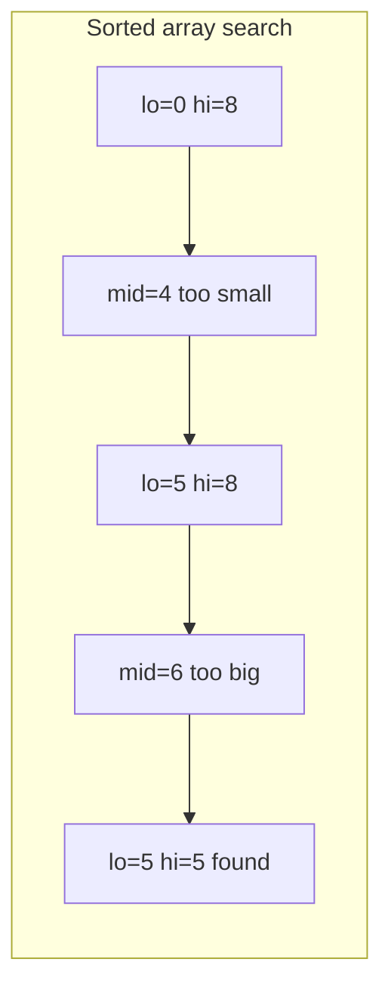
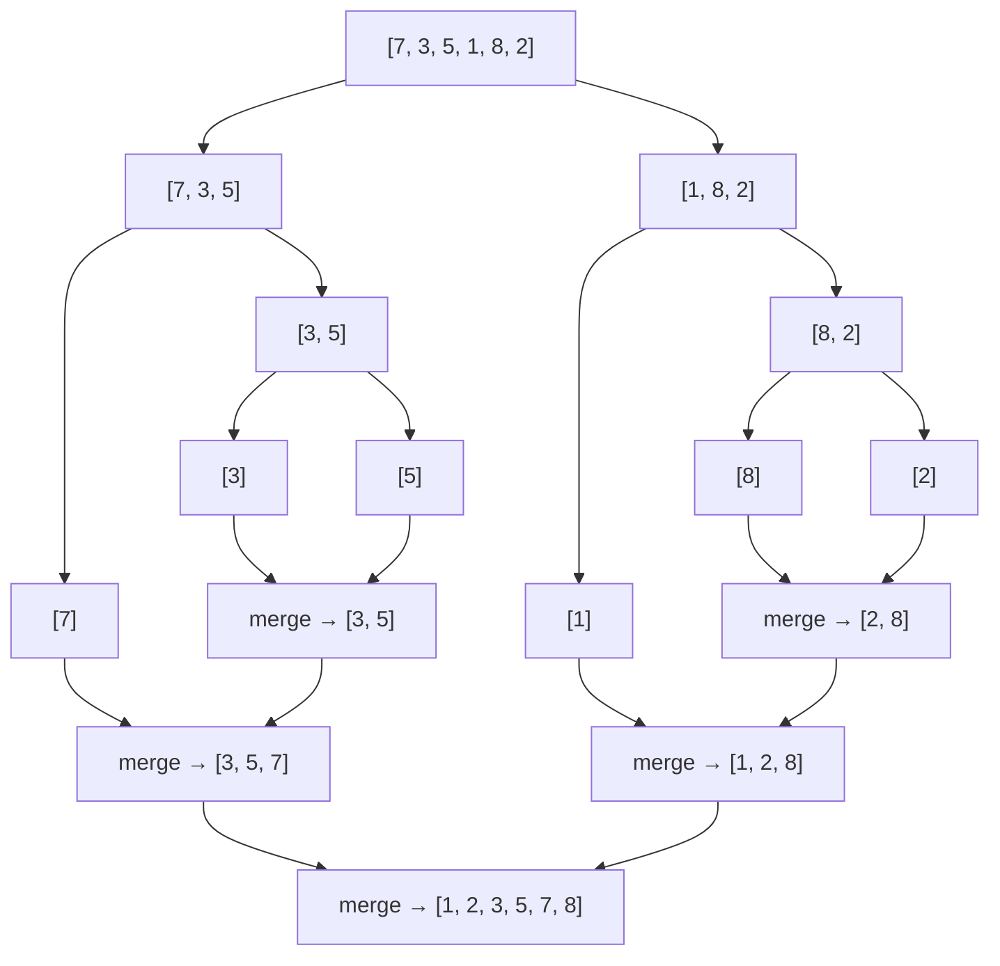

# Searching & Sorting: binary search on answer, quick sort, merge sort

Search and sort algorithms are the most reused tools in your toolkit. Senior interviews care less about reciting the code and more about **picking the right one** and **explaining the invariant** that makes it correct.

## Binary search

Binary search works any time you have a **monotonic predicate** over a range — values transition from `false → true` exactly once, and you want the boundary. The classic case is a sorted array, but the technique applies far more broadly.



```java
// Find target in a sorted array; return index or -1
int binarySearch(int[] a, int target) {
    int lo = 0, hi = a.length - 1;
    while (lo <= hi) {
        int mid = lo + (hi - lo) / 2;     // not (lo + hi) / 2 — overflow risk
        if (a[mid] == target) return mid;
        if (a[mid] < target) lo = mid + 1;
        else                 hi = mid - 1;
    }
    return -1;
}
```

The classic bug: `mid = (lo + hi) / 2` overflows when both are near `Integer.MAX_VALUE`. Always use `lo + (hi - lo) / 2`.

## Binary search on the answer

The harder pattern: the **answer space** itself is the search range. The question becomes "what is the smallest (or largest) value `x` such that some predicate `can(x)` is true?"

Classic problem: Koko has `piles[]` of bananas. She eats `k` bananas per hour from one pile. What is the smallest `k` so she finishes in `h` hours?

```java
int minEatingSpeed(int[] piles, int h) {
    int lo = 1, hi = Arrays.stream(piles).max().getAsInt();
    while (lo < hi) {
        int mid = lo + (hi - lo) / 2;
        long hours = 0;
        for (int p : piles) hours += (p + mid - 1) / mid;  // ceiling division
        if (hours <= h) hi = mid;            // feasible — try smaller
        else            lo = mid + 1;
    }
    return lo;
}
```

The hard part is writing `can(x)` correctly. Once that is right, the search itself is mechanical: find the boundary between "cannot do it" and "can do it."

This pattern solves: "split array into k subarrays, minimise the max sum"; "ship packages within `D` days"; "smallest divisor"; "minimise maximum distance to gas stations." Always look for `if can(x), then can(x+1) too` — that monotonicity is the precondition.

## Sorting

You will not implement these from memory in production — `Arrays.sort` exists. You **will** have to reason about which one runs underneath, what the worst case is, and when it matters.

| Algorithm      | Average      | Worst        | Space      | Stable | In-place | Real-world note                        |
| -------------- | ------------ | ------------ | ---------- | ------ | -------- | -------------------------------------- |
| Quick sort     | `O(n log n)` | `O(n²)`      | `O(log n)` | No     | Yes      | Cache-friendly, very fast in practice  |
| Merge sort     | `O(n log n)` | `O(n log n)` | `O(n)`     | Yes    | No       | Linked lists, external sort            |
| Heap sort      | `O(n log n)` | `O(n log n)` | `O(1)`     | No     | Yes      | Worst-case bound, weak constants       |
| Tim sort       | `O(n log n)` | `O(n log n)` | `O(n)`     | Yes    | No       | Java/Python default, fast on real data |
| Counting/Radix | `O(n + k)`   | `O(n + k)`   | `O(n + k)` | Yes    | No       | When key universe is bounded           |

## Quick sort

Pick a pivot, partition the array so smaller values go left and larger go right, recurse on both halves.

```java
void quickSort(int[] a, int lo, int hi) {
    if (lo >= hi) return;
    int pivot = a[lo + (int) (Math.random() * (hi - lo + 1))];  // random pivot
    int i = lo, j = hi;
    while (i <= j) {
        while (a[i] < pivot) i++;
        while (a[j] > pivot) j--;
        if (i <= j) { swap(a, i, j); i++; j--; }
    }
    quickSort(a, lo, j);
    quickSort(a, i, hi);
}
```

The worst case `O(n²)` happens when the pivot is consistently the smallest or largest. **Random pivot** or median-of-three makes that vanishingly rare for adversarial inputs.

## Merge sort

Recursively split the array, sort each half, then merge.

```java
int[] mergeSort(int[] a) {
    if (a.length <= 1) return a;
    int mid = a.length / 2;
    int[] left = mergeSort(Arrays.copyOfRange(a, 0, mid));
    int[] right = mergeSort(Arrays.copyOfRange(a, mid, a.length));
    return merge(left, right);
}

int[] merge(int[] a, int[] b) {
    int[] out = new int[a.length + b.length];
    int i = 0, j = 0, k = 0;
    while (i < a.length && j < b.length) {
        out[k++] = a[i] <= b[j] ? a[i++] : b[j++];   // <= preserves stability
    }
    while (i < a.length) out[k++] = a[i++];
    while (j < b.length) out[k++] = b[j++];
    return out;
}
```

Merge sort guarantees `O(n log n)` even on adversarial inputs. The cost is `O(n)` extra memory. The merge step also lets you count inversions, find the kth smallest across two sorted arrays, and run external sort on data that does not fit in memory.



## Picking a sort

- Default to your language's built-in sort. Java's `Arrays.sort` uses dual-pivot quick sort for primitives and Tim sort for objects (stable).
- Need stability (preserve order of equal keys)? Tim sort or merge sort.
- Sorting linked lists? Merge sort (no random access).
- Worst-case `O(n log n)` guaranteed? Merge sort or heap sort.
- Small bounded keys (e.g. ages 0–120)? Counting sort, `O(n)`.
- Strings or fixed-width integers? Radix sort.

## Common mistakes

- **Off-by-one in binary search bounds**. The "while `lo <= hi`" vs "while `lo < hi`" pattern depends on whether you converge on a single index or a half-open boundary. Pick a template, stick to it.
- **Forgetting that `Arrays.sort` on primitives is not stable**. Use `List<Integer>` or sort objects if stability matters.
- **Using sort when partial sort suffices**. "Top k" should use a heap, not a full sort.
- **Mutating during merge**. Stable merge requires `<=` not `<`; flipping it loses stability and may violate correctness in some adapter algorithms.

## Interview answers

_Q: Why does binary search converge in `O(log n)`?_
A: Each step halves the search range. Starting from `n`, after `log₂(n)` halvings the range is one element. Each step is constant work, so total time is `O(log n)`.

_Q: When is quick sort `O(n²)`?_
A: When the pivot is consistently extreme — already sorted (or reverse-sorted) input with a fixed first-element pivot. Random pivot or median-of-three brings expected complexity to `O(n log n)` with vanishingly low probability of degeneracy.

_Q: How would you sort 1 TB of data on a machine with 4 GB of RAM?_
A: External merge sort. Split into chunks that fit in RAM, sort each in memory, write back to disk as runs. Then k-way merge using a min-heap of run pointers, streaming through the data once. Most database engines and `sort -u` work this way.

_Q: When would you prefer merge sort over Tim sort?_
A: Implementing it yourself, or sorting linked lists where Tim sort's array-based runs do not apply. In practice, Tim sort wins on partially sorted real-world data because it identifies and uses existing runs in `O(n)`.

_Q: Walk me through "find first occurrence of target in a sorted array with duplicates."_
A: Binary search variant. Replace `if a[mid] == target return mid` with: keep narrowing `hi = mid` when `a[mid] >= target`; narrow `lo = mid + 1` when `a[mid] < target`. Loop while `lo < hi`. Final `lo` is the first index where `a[lo] >= target` — verify equality before returning.

_Q: What sort would you choose if the keys are strings of length up to 64?_
A: Radix sort if the comparison cost dominates and memory allows — `O(n * L)` where `L` is the max length. Tim sort otherwise — its run detection plus stable merge plays well with real string data and the standard library is well-tuned.
