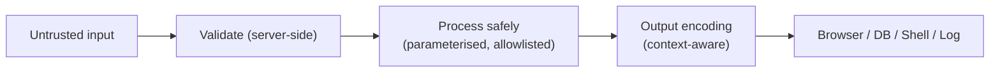
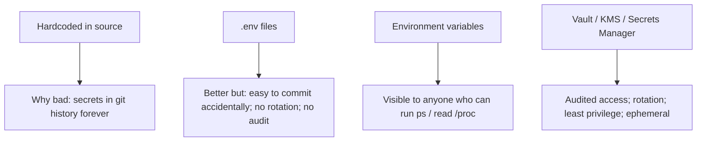
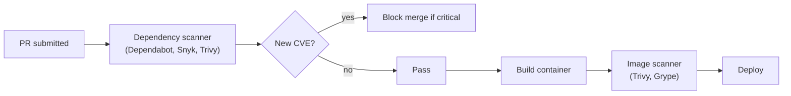

# Secure coding: input validation, output encoding, secret management, dependency scanning

OWASP and crypto cover _what_ to defend against. Secure coding is _how_ — the daily habits that keep vulnerabilities out. **Senior engineers ship code that does not introduce common bugs**. Most CVEs trace back to violations of the patterns below.

## The defensive mindset

Two questions before any function processes data:

1. **Where did this data come from?** Trusted (your DB, your code) or untrusted (user, network, file)?
2. **Where is it going?** SQL query? HTML? Shell? Logging? Each destination has its own escaping rules.



The trap: assuming validation alone is enough. **Validate on input AND escape on output.** Different sinks need different escaping; one global "sanitise" function doesn't work.

## Input validation

### Allowlist over denylist

```java
// BAD — denylist tries to block bad things; always misses something
if (filename.contains("../") || filename.contains("..\\")) reject();

// GOOD — allowlist defines what's allowed
if (!filename.matches("^[a-zA-Z0-9._-]{1,255}$")) reject();
```

Denylists are how SQL injection survived for 20 years. The right model: **define the small set of valid inputs and reject everything else**.

### Validate at boundaries

```java
record CreateUser(String email, int age, String username) {}

// At the controller — validate before any business logic touches the data
public void createUser(@Valid @RequestBody CreateUser req) {
    // req has already been validated by Bean Validation annotations
}

// On the record itself
record CreateUser(
    @Email @NotBlank @Size(max = 254) String email,
    @Min(13) @Max(150) int age,
    @Pattern(regexp = "^[a-zA-Z0-9_]{3,20}$") String username
) {}
```

Validation lives at the **boundary** of trust. Internal code can assume already-validated data; otherwise checks scatter everywhere and miss spots.

### Server-side, always

Client-side validation is for UX only. Never trust it. Curl can bypass any browser check.

```js
// Client-side: nice to have for instant feedback
if (email.includes('@')) { ... }

// Server-side: required, mandatory
@Email String email;
```

### Common input validation rules

| Field type  | Validation                                                      |
| ----------- | --------------------------------------------------------------- |
| Email       | RFC 5322 regex, max 254 chars, normalise (lowercase domain)     |
| Username    | Allowlist `[a-z0-9_-]`, length range, deny reserved words       |
| URL         | Parse and check scheme (`https` only), check hostname allowlist |
| Filename    | Allowlist alphanumeric + `.-_`, no path separators              |
| Integer     | Check range, beware of overflow                                 |
| File upload | Check size, MIME type (server-side detection), re-encode        |
| JSON        | Schema validation (Jackson, Zod, Pydantic); cap depth           |
| HTML        | Allowlist tags via DOMPurify; never raw                         |

## Output encoding

Same data, different sinks, different escaping.

```java
// In HTML body
<div>${escapeHtml(name)}</div>           // & → &amp;, < → &lt;, > → &gt;

// In HTML attribute
<input value="${escapeHtmlAttr(name)}">  // also " → &quot;

// In JS string in HTML
<script>var n = "${escapeJs(name)}"</script>   // also \ → \\, ' → \'

// In URL query string
<a href="?q=${urlEncode(name)}">         // spaces → %20, etc.

// In SQL — always parameterise, never escape manually
PreparedStatement ps = conn.prepareStatement("... WHERE name = ?");
ps.setString(1, name);

// In shell command — always use ProcessBuilder with arg array
new ProcessBuilder("convert", filename, "-thumbnail", "100x100", out).start();
```

Most modern templating engines (React, Thymeleaf, Handlebars) auto-escape by default. **Don't disable** (`dangerouslySetInnerHTML`, `innerHTML`, `safeMark`) without a clear reason and DOMPurify.

## Secret management



| Approach                                 | OK?                                                                        |
| ---------------------------------------- | -------------------------------------------------------------------------- |
| Source code                              | Never                                                                      |
| Config files in repo                     | Never                                                                      |
| `.env` (gitignored)                      | Local dev only                                                             |
| Env vars                                 | Acceptable for ephemeral; rotate manually                                  |
| AWS Secrets Manager / GCP Secret Manager | Production standard                                                        |
| HashiCorp Vault                          | Multi-cloud / on-prem; advanced                                            |
| Kubernetes Secrets                       | Base64-encoded, not encrypted by default; pair with Vault or SealedSecrets |

### Reading secrets safely

```java
// Spring example
@Component
class PaymentClient {
    private final String apiKey;

    PaymentClient(@Value("${payment.api-key}") String apiKey) {
        this.apiKey = apiKey;
    }
}
```

`payment.api-key` is wired from a secret manager via Spring Cloud Config / AWS Parameter Store / Vault Spring integration — not from source.

### Never log secrets

```java
log.info("Calling payment API with key={}", apiKey);   // BAD — secrets in logs forever

log.info("Calling payment API");                       // GOOD
```

Use SLF4J `MDC` only for non-secret context (request id, user id). Don't log: passwords, API keys, tokens, full credit-card numbers, full SSNs. Most log aggregators retain logs for 90+ days; anything logged is essentially permanent.

### Rotate secrets

- Database passwords: 90 days, automated.
- API keys: 6-12 months; immediately on team member departure.
- TLS certs: Let's Encrypt 90-day automatic.
- KMS root keys: yearly.
- JWT signing keys: 30-90 days, with rolling JWKS.

If rotation is hard, you'll skip it. Automate.

## Dependency scanning

Modern apps have hundreds of transitive dependencies. Each one is potential vulnerability surface.



| Tool                   | Scope                                           |
| ---------------------- | ----------------------------------------------- |
| Dependabot (GitHub)    | Auto-PRs for vulnerable deps                    |
| Snyk                   | Comprehensive; commercial; container + IaC scan |
| OWASP Dependency-Check | Free; Java focus; CI integration                |
| Trivy                  | Free; container + IaC + deps; fast              |
| Renovate               | Like Dependabot but more configurable           |
| npm audit / pnpm audit | Built-in for Node                               |

**Best practices**:

- Scan in CI on every PR; fail on critical CVEs.
- Run image scans before deploy.
- Generate an **SBOM** (CycloneDX, SPDX) per release for supply chain transparency.
- Pin direct dependencies; let lock files pin transitive.
- Have a documented "patch within X hours" SLA per CVE severity.

### Patch policy template

| Severity                      | SLA                          |
| ----------------------------- | ---------------------------- |
| Critical (RCE, data exposure) | 24-72 hours                  |
| High                          | 1 week                       |
| Medium                        | 30 days                      |
| Low                           | Best-effort, regular cadence |

Critical CVEs (Log4Shell, Spring4Shell) require **drop-everything response**. Have a runbook.

## Defensive coding patterns

### Fail closed, not open

```java
// BAD — exception means user gets through
boolean canAccess(User u, Resource r) {
    try {
        return acl.check(u, r);
    } catch (Exception e) {
        log.warn("ACL check failed", e);
        return true;       // ← attacker triggers ACL exception → bypass
    }
}

// GOOD — exception means deny
boolean canAccess(User u, Resource r) {
    try {
        return acl.check(u, r);
    } catch (Exception e) {
        log.warn("ACL check failed", e);
        return false;
    }
}
```

When in doubt, **default to denying access**. Failures should not be holes.

### Principle of least privilege

```java
// Don't run the app as root
// Don't grant the DB user CREATE TABLE if they only need SELECT/INSERT
// Don't issue an admin JWT if a read-only token suffices

// PostgreSQL: separate roles per service
CREATE ROLE app_read LOGIN PASSWORD '...';
GRANT SELECT ON ALL TABLES IN SCHEMA public TO app_read;

CREATE ROLE app_write LOGIN PASSWORD '...';
GRANT SELECT, INSERT, UPDATE ON orders, line_items TO app_write;
-- app_write CANNOT touch users, payments, etc.
```

### Idempotency for writes

A retried request should not double-spend. See `topic_consensus_leader` — idempotency keys + uniqueness constraints.

### Rate limit everything

Login endpoints. Password reset. Forgot password. Token issuance. Search APIs. **Per-IP, per-user, per-endpoint**. See `topic_rate_limiter`.

### Time-constant comparison for secrets

```java
// BAD — timing attack
boolean ok = expectedToken.equals(providedToken);   // returns early on mismatch

// GOOD — constant time
boolean ok = MessageDigest.isEqual(expected, provided);
```

The `equals` short-circuits on first mismatched byte. An attacker times responses to learn the token byte-by-byte. Use library-provided constant-time compare.

### Generate random IDs / tokens with `SecureRandom`

```java
// BAD — predictable
String token = UUID.randomUUID().toString();   // OK for IDs, NOT for security tokens

// GOOD — cryptographically random
SecureRandom sr = new SecureRandom();
byte[] bytes = new byte[32];
sr.nextBytes(bytes);
String token = Base64.getUrlEncoder().withoutPadding().encodeToString(bytes);
```

`Math.random()` and `Random` are predictable. For session tokens, password reset tokens, API keys — `SecureRandom`.

### Separate authn and authz logs

Authentication events (login attempts, MFA challenges) and authorisation events (access denied) are security-relevant. Send to a SIEM separate from app logs; retain longer; alert on anomalies.

## Common mistakes

- **Trusting client-side validation**. Curl bypasses everything.
- **Catching `Exception` and continuing**. Hides broken auth checks. Catch specific exceptions.
- **Sanitise once at the boundary, then trust forever**. Different output sinks need different escaping. Sanitise on output to context.
- **Storing JWT in localStorage**. XSS reads it. HttpOnly cookie is safer for browsers.
- **Logging request bodies**. Personal data and credentials end up in log archives.
- **Using `Random` for tokens**. Predictable; use `SecureRandom`.
- **Treating "internal" services as trusted**. Lateral movement is a thing. Defence in depth.
- **No SBOM, no patch policy, no rotation schedule**. Security debt accumulates silently.
- **Default-allow firewalls / IAM policies**. Default-deny; explicitly allow.

## Interview answers

_Q: How would you protect against credential stuffing?_
A: Layered. Rate limit per IP and per account. Lock account temporarily after N failed attempts. Use bcrypt/argon2id for passwords (slow). Compare against known-breached password list (HaveIBeenPwned API). Add CAPTCHA after a few failures. Require MFA for high-value accounts. Monitor login telemetry for anomalies (impossible travel, sudden burst from one ASN).

_Q: Where do you store secrets in a production microservice?_
A: A secret manager — AWS Secrets Manager, GCP Secret Manager, or HashiCorp Vault. The service authenticates with its IAM role / Kubernetes service account; no static credentials. Rotation is automated. Access is audited. Never in source, env vars (visible in process listings), or unencrypted config files.

_Q: How would you handle a critical CVE in a transitive dependency?_
A: First check if exploitable in our usage — most CVEs require specific calls. If not exploitable, document and pin to safe version. If exploitable, override the version with `dependencyManagement` (Maven) or `overrides` (npm). If no fix exists, mitigate at runtime with a WAF rule or input filter. Report to Security Champions, file a tracking ticket, set patch SLA.

_Q: What's the difference between authentication and authorisation in code?_
A: Authentication is "who is this request from?" — usually middleware that decodes a token and sets `currentUser`. Authorisation is "is the current user allowed to do this?" — checked per-resource at the data layer. Many breaches are authenticated-but-not-authorised (IDOR). Centralise the check.

_Q: How do you decide what to log vs what not to log?_
A: Log: timestamps, request IDs, trace IDs, user IDs, action type, status code, latency. Don't log: passwords, full tokens, payment details, full SSN, raw request bodies (without sanitising), API responses with PII. Default to log-then-redact; use library to mask before serialisation.

_Q: How would you rotate a JWT signing key without breaking active sessions?_
A: Roll keys via JWKS. Generate new key pair; add to JWKS endpoint with new `kid`. Issue new tokens with new key. Verifiers fetch JWKS, accept tokens from either key. After old tokens have expired (e.g. 24h), retire the old key from JWKS. Standard rotation pattern.

_Q: What is the principle of least privilege and how do you apply it?_
A: Every component gets only the permissions it needs. App runs as non-root. DB user has only the tables/operations it uses (no DDL, no superuser). IAM roles per service, not shared. Network policies restrict service-to-service traffic to required calls only. Reduces blast radius of a compromise.

_Q: How do you keep dependencies safe over time?_
A: Automated scanning in CI (Dependabot, Snyk, Trivy). SBOM per release. Documented patch SLA per severity. Minimal dependency set — fewer libs → fewer CVEs. Run `npm audit` / `mvn dependency:tree` regularly. Avoid forks of unmaintained libs; prefer well-maintained alternatives.
