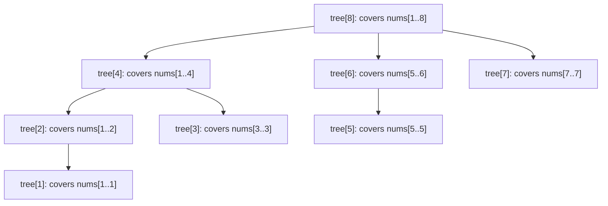
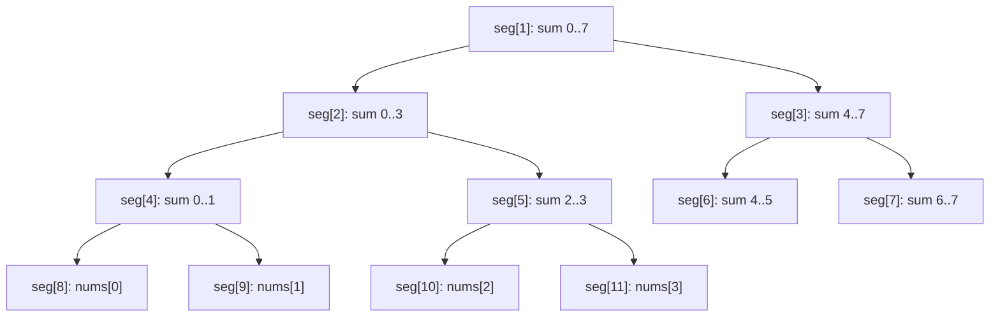

# Segment Trees & Fenwick (BIT): range queries, lazy propagation

Segment trees and Fenwick (Binary Indexed) trees solve the same problem: **answer range queries and apply updates in `O(log n)` each**. Without them, range-sum is either `O(n)` per query (scan) or `O(n)` per update (rebuild prefix sums). Either is fast; both at the same time is the trick.

| Need                                                             | Use                                |
| ---------------------------------------------------------------- | ---------------------------------- |
| Point update + prefix sum (or invertible op)                     | Fenwick (BIT)                      |
| Range update + range query, or non-invertible op (min, max, gcd) | Segment tree                       |
| Range update + range query, very hot loop                        | Segment tree with lazy propagation |

## Fenwick tree (BIT)

The Fenwick tree is a clever array layout where `tree[i]` stores the sum of a specific range of `nums` defined by the lowest set bit of `i`. Two short loops give you point update and prefix sum in `O(log n)`.

```java
class BIT {
    int[] tree;
    BIT(int n) { tree = new int[n + 1]; }   // 1-indexed

    void update(int i, int delta) {
        for (; i < tree.length; i += i & -i) tree[i] += delta;
    }

    int prefix(int i) {
        int sum = 0;
        for (; i > 0; i -= i & -i) sum += tree[i];
        return sum;
    }

    int range(int l, int r) { return prefix(r) - prefix(l - 1); }
}
```

The magic is `i & -i` — it isolates the lowest set bit. Walking `i += i & -i` jumps up to the next responsible parent; walking `i -= i & -i` walks back through ancestors covering the prefix.



Memorise the two loops; they are short enough to write live in interviews.

**Limitation**: only works for invertible operations. Sum and XOR are fine; min and max are not (you cannot "subtract" a min).

## Segment tree

A segment tree explicitly stores aggregate values for every contiguous range, organised as a binary tree. Each leaf holds one element; each internal node holds the aggregate of its children.



Allocate `seg = new int[4 * n]` to be safe for the recursive layout. Build, query, and point-update are short:

```java
class SegmentTree {
    int[] seg;
    int n;

    SegmentTree(int[] a) {
        n = a.length;
        seg = new int[4 * n];
        build(1, 0, n - 1, a);
    }

    private void build(int node, int l, int r, int[] a) {
        if (l == r) { seg[node] = a[l]; return; }
        int m = (l + r) >>> 1;
        build(2 * node, l, m, a);
        build(2 * node + 1, m + 1, r, a);
        seg[node] = seg[2 * node] + seg[2 * node + 1];
    }

    int query(int ql, int qr) { return query(1, 0, n - 1, ql, qr); }

    private int query(int node, int l, int r, int ql, int qr) {
        if (qr < l || r < ql) return 0;             // outside
        if (ql <= l && r <= qr) return seg[node];   // fully inside
        int m = (l + r) >>> 1;
        return query(2 * node, l, m, ql, qr)
             + query(2 * node + 1, m + 1, r, ql, qr);
    }

    void update(int idx, int val) { update(1, 0, n - 1, idx, val); }

    private void update(int node, int l, int r, int idx, int val) {
        if (l == r) { seg[node] = val; return; }
        int m = (l + r) >>> 1;
        if (idx <= m) update(2 * node, l, m, idx, val);
        else update(2 * node + 1, m + 1, r, idx, val);
        seg[node] = seg[2 * node] + seg[2 * node + 1];
    }
}
```

Swap `+` for `Math.min`, `Math.max`, GCD, or any associative operation. The structure is the same.

## Lazy propagation — range update + range query

Naive range update on a segment tree is `O(n log n)` (touch every leaf in the range). Lazy propagation defers the work: store the pending update at the smallest node fully covered, push it down only when a query or another update reaches deeper.

```java
class LazySegTree {
    long[] seg, lazy;
    int n;

    LazySegTree(int[] a) {
        n = a.length;
        seg = new long[4 * n];
        lazy = new long[4 * n];
        build(1, 0, n - 1, a);
    }

    private void push(int node, int l, int r) {
        if (lazy[node] != 0) {
            int m = (l + r) >>> 1;
            apply(2 * node, l, m, lazy[node]);
            apply(2 * node + 1, m + 1, r, lazy[node]);
            lazy[node] = 0;
        }
    }

    private void apply(int node, int l, int r, long delta) {
        seg[node] += (long)(r - l + 1) * delta;
        lazy[node] += delta;
    }

    void rangeAdd(int ql, int qr, long delta) { rangeAdd(1, 0, n - 1, ql, qr, delta); }

    private void rangeAdd(int node, int l, int r, int ql, int qr, long delta) {
        if (qr < l || r < ql) return;
        if (ql <= l && r <= qr) { apply(node, l, r, delta); return; }
        push(node, l, r);
        int m = (l + r) >>> 1;
        rangeAdd(2 * node, l, m, ql, qr, delta);
        rangeAdd(2 * node + 1, m + 1, r, ql, qr, delta);
        seg[node] = seg[2 * node] + seg[2 * node + 1];
    }

    long rangeSum(int ql, int qr) { return rangeSum(1, 0, n - 1, ql, qr); }

    private long rangeSum(int node, int l, int r, int ql, int qr) {
        if (qr < l || r < ql) return 0;
        if (ql <= l && r <= qr) return seg[node];
        push(node, l, r);
        int m = (l + r) >>> 1;
        return rangeSum(2 * node, l, m, ql, qr) + rangeSum(2 * node + 1, m + 1, r, ql, qr);
    }

    private void build(int node, int l, int r, int[] a) {
        if (l == r) { seg[node] = a[l]; return; }
        int m = (l + r) >>> 1;
        build(2 * node, l, m, a);
        build(2 * node + 1, m + 1, r, a);
        seg[node] = seg[2 * node] + seg[2 * node + 1];
    }
}
```

The `apply` adds `delta` to the aggregate of an entire range without traversing it. The `push` propagates the pending delta down only when needed. Total amortised cost: `O(log n)` per operation.

## Complexity summary

| Structure                            | Build        | Query            | Point update     | Range update    | Memory  |
| ------------------------------------ | ------------ | ---------------- | ---------------- | --------------- | ------- |
| Fenwick                              | `O(n log n)` | `O(log n)`       | `O(log n)`       | not directly    | `O(n)`  |
| Fenwick (range update + point query) | `O(n log n)` | `O(log n)` point | `O(log n)` range | not range query | `O(n)`  |
| Segment tree                         | `O(n)`       | `O(log n)`       | `O(log n)`       | not directly    | `O(4n)` |
| Segment tree + lazy                  | `O(n)`       | `O(log n)`       | `O(log n)`       | `O(log n)`      | `O(4n)` |

## When you might use these in real systems

- Time-series databases use related ideas (compressed range trees) to answer aggregate queries over windows.
- Database query optimisers build histograms that look like coarse segment trees.
- Any "running median," "k-th order statistic in a range," or "interval arithmetic" workload at scale.

## Common mistakes

- **Forgetting `push` before recursing in lazy segment tree**. The pending lazy value is mid-flight; descending without pushing returns stale aggregates.
- **Using Fenwick for non-invertible operations**. Min and max do not have inverses, so prefix-min minus prefix-min is meaningless. Use a segment tree.
- **Allocating `seg = new int[2 * n]`**. Sometimes too small for the recursive indexing scheme. `4 * n` is the safe size.
- **Off-by-one between 0-indexed and 1-indexed**. Fenwick trees are conventionally 1-indexed; segment trees are usually 0-indexed. Pick a convention and document it.

## Interview answers

_Q: How does the Fenwick tree's `i & -i` trick work?_
A: It isolates the lowest set bit of `i`. That bit determines the size of the range `tree[i]` covers. Walking `i -= i & -i` strips one bit at a time, visiting at most `log n` ancestors that together cover the prefix.

_Q: When would you pick a segment tree over a Fenwick tree?_
A: When the operation is not invertible (min, max, gcd, set membership) or when you need range updates. Fenwick is shorter and uses less memory, so use it whenever you can.

_Q: How does lazy propagation save time?_
A: Without lazy, a range update touches every leaf in the range — `O(n)` per update in the worst case. Lazy stores the pending delta at the smallest fully-covering node and applies it only when a deeper operation needs accurate values. Each `push` happens at most `O(log n)` times per operation, giving `O(log n)` amortised cost.

_Q: Walk me through querying `range(2, 5)` on a segment tree of 8 elements._
A: Start at root, range 0–7. Query overlaps 0–3 and 4–7. Recurse left with 2–5 query: range 0–3 partially overlaps. Recurse left into 0–1 (no overlap, return 0) and 2–3 (fully inside, return `seg[5]`). Right child 4–7 partially overlaps. Recurse into 4–5 (fully inside, return `seg[6]`) and 6–7 (no overlap). Sum = `seg[5] + seg[6]`.

_Q: How would you implement "find the k-th smallest element" with a segment tree?_
A: Build a segment tree where each node stores the count of elements in that range. To find the k-th smallest, descend: if the left subtree has ≥ k elements, go left; otherwise subtract and go right with `k - leftCount`. `O(log n)` per query. This is the basis of "merge sort tree" and "persistent segment tree" patterns for offline range-rank queries.
