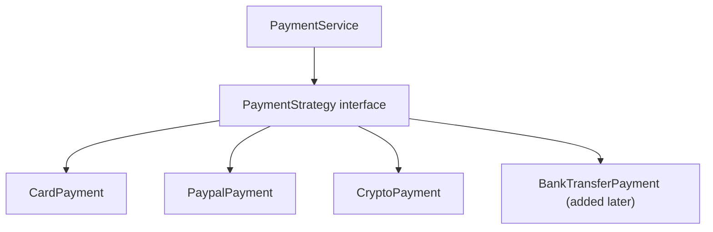
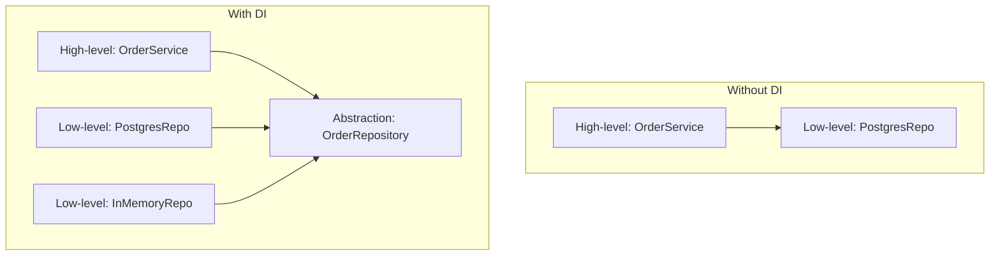

# SOLID principles with Java examples

SOLID is five design principles introduced by Robert C. Martin. They are not laws — they are heuristics that **make change cheaper** by reducing coupling, clarifying intent, and isolating reasons-to-change. Senior code review and design discussions rely on this vocabulary.

| Letter | Principle             | One-liner                                    |
| ------ | --------------------- | -------------------------------------------- |
| S      | Single Responsibility | A class has one reason to change             |
| O      | Open/Closed           | Open for extension, closed for modification  |
| L      | Liskov Substitution   | Subclasses must work where the parent works  |
| I      | Interface Segregation | Many small interfaces beat one fat interface |
| D      | Dependency Inversion  | Depend on abstractions, not concretions      |

## S — Single Responsibility

A class should have one reason to change. The "reason" is a stakeholder or concern, not a method count.

```java
// Bad — three reasons to change
class OrderService {
    public Order createOrder(...) { ... }       // business logic
    public void saveToDatabase(Order o) { ... } // persistence
    public void sendConfirmationEmail(...) { ... } // notification
    public String formatInvoice(Order o) { ... }  // formatting
}

// Better — one reason each
class OrderService { /* business logic */ }
class OrderRepository { /* persistence */ }
class NotificationService { /* email */ }
class InvoiceFormatter { /* formatting */ }
```

The test: when product asks for a tweak to invoice format, you should not have to think about the database. When the DBA changes a column, you should not have to think about email templates.

## O — Open/Closed

Software should be open for **extension** but closed for **modification**. Adding a new variant should not require rewriting tested, stable code.

```java
// Bad — every new payment method modifies this class
class PaymentService {
    public void pay(String type, Money amount) {
        if ("card".equals(type)) { ... }
        else if ("paypal".equals(type)) { ... }
        else if ("crypto".equals(type)) { ... }   // ← edit on every new method
    }
}

// Good — add a new strategy without touching existing code
interface PaymentStrategy {
    void pay(Money amount);
}
class CardPayment implements PaymentStrategy { ... }
class PaypalPayment implements PaymentStrategy { ... }
class CryptoPayment implements PaymentStrategy { ... }   // ← add a class, don't touch existing
```



## L — Liskov Substitution

If `B` is a subclass of `A`, you should be able to use `B` anywhere the code expects `A` without surprises.

```java
// Classic violation
class Rectangle {
    protected int width, height;
    public void setWidth(int w) { this.width = w; }
    public void setHeight(int h) { this.height = h; }
    public int area() { return width * height; }
}

class Square extends Rectangle {
    @Override public void setWidth(int w) { this.width = w; this.height = w; }
    @Override public void setHeight(int h) { this.width = h; this.height = h; }
}

// Caller that worked for Rectangle now breaks for Square
void test(Rectangle r) {
    r.setWidth(5);
    r.setHeight(10);
    assert r.area() == 50;   // FAILS for Square — area is 100
}
```

The square "is-a" rectangle in math but **not in software**, because the contract of `Rectangle` lets independent dimensions.

Common LSP violations:

- Subclass throws `UnsupportedOperationException` for inherited methods.
- Subclass strengthens preconditions ("but only if x > 0").
- Subclass weakens postconditions ("returns null sometimes").

If a subclass cannot honour the parent's contract, it should not extend it.

## I — Interface Segregation

Clients should not depend on methods they do not use.

```java
// Bad — fat interface
interface Worker {
    void work();
    void eat();
    void sleep();
    void clockIn();
    void receivePaycheck();
}

class RobotWorker implements Worker {
    public void work() { ... }
    public void eat() { throw new UnsupportedOperationException(); }   // ← LSP + ISP violation
    public void sleep() { throw new UnsupportedOperationException(); }
    ...
}

// Good — split by role
interface Workable { void work(); }
interface Eatable { void eat(); }
interface Sleepable { void sleep(); }

class HumanWorker implements Workable, Eatable, Sleepable { ... }
class RobotWorker implements Workable { ... }
```

Small role-specific interfaces let unrelated clients depend on only what they need. Easier to mock in tests, easier to swap implementations.

## D — Dependency Inversion

High-level modules should not depend on low-level modules. Both should depend on **abstractions**. Abstractions should not depend on details; details depend on abstractions.

```java
// Bad — high-level module depends directly on a concrete class
class OrderService {
    private final PostgresOrderRepository repo = new PostgresOrderRepository();   // tightly coupled
    public void createOrder(...) {
        repo.save(...);
    }
}

// Good — depends on an abstraction, concrete is injected
interface OrderRepository { void save(Order o); }
class PostgresOrderRepository implements OrderRepository { ... }
class InMemoryOrderRepository implements OrderRepository { ... }   // for tests

class OrderService {
    private final OrderRepository repo;
    public OrderService(OrderRepository repo) { this.repo = repo; }
}
```



This unlocks:

- **Testability** — pass a fake to the constructor.
- **Replacability** — swap Postgres for DynamoDB without changing the service.
- **Inversion of control** — Spring, Guice, and other DI containers wire dependencies for you.

## When SOLID becomes counterproductive

Over-applying SOLID makes code worse:

- **Single Responsibility taken to "one method per class"** — explosion of tiny classes hurts readability.
- **Open/Closed via inheritance hierarchies** — composition is usually better.
- **Interface Segregation creating dozens of single-method interfaces** — interface salad.
- **Dependency Inversion for everything** — even one-off internal helpers behind interfaces add ceremony with no benefit.

Apply SOLID where the **cost of change is high** and the abstraction earns its keep. For throwaway scripts, glue code, and one-off helpers, simpler is better.

## Common pitfalls

- **Treating SOLID as rules, not heuristics**. Use them when they help; ignore when they don't.
- **Adding interfaces "just in case"** without a second implementation in sight. YAGNI.
- **Single-use strategies that are just an `if`**. The strategy pattern shines when there are 3+ variants and they are likely to grow.
- **DI without DI container** — hand-wiring 50 dependencies is painful. Spring, Dagger, or Guice exist for a reason.

## Interview answers

_Q: Walk me through a violation of Single Responsibility you've seen._
A: A `UserService` that authenticated users, fetched profiles, sent emails on signup, and exposed REST endpoints. Each new feature touched it. We split into `AuthService`, `UserRepository`, `NotificationService`, and `UserController`. Code review velocity went up; merge conflicts went down.

_Q: How does the Open/Closed Principle relate to plugins?_
A: A plugin architecture is OCP at the system level. The host loads new behavior at runtime via a plugin interface. The host is closed for modification (no rebuild on new plugins). Plugins extend functionality. Same idea, larger scale.

_Q: When does inheritance violate Liskov Substitution?_
A: Whenever the subclass weakens guarantees the parent makes. `ImmutableList extends List` violates LSP because mutating methods on `List` throw on `ImmutableList`. Java does this, accepted as a pragmatic compromise. The lesson: a subclass that cannot honour the contract should not extend the parent — prefer composition.

_Q: How does Dependency Inversion enable testing?_
A: Tests can pass mock or fake implementations of dependencies through the constructor. Without DI, the class instantiates its own dependencies and tests cannot substitute them — tests need real databases, real APIs. With DI, you inject in-memory or stubbed implementations.

_Q: Is "use interfaces instead of classes" always good design?_
A: No. Adding interfaces "just in case" without a real second implementation adds indirection without benefit. The rule is YAGNI — add interfaces when you have or anticipate multiple implementations, or when testing requires a substitution point. Otherwise a concrete class is fine.

_Q: How does Spring's bean configuration relate to SOLID?_
A: Spring DI directly implements Dependency Inversion. Components depend on interfaces, Spring wires the right implementation at startup. `@Profile` and `@Conditional` annotations enable Open/Closed at the configuration layer — adding a new implementation does not modify existing wiring.
