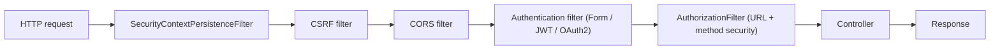
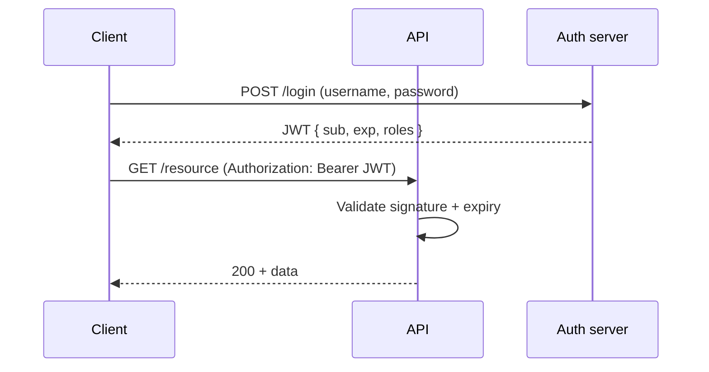
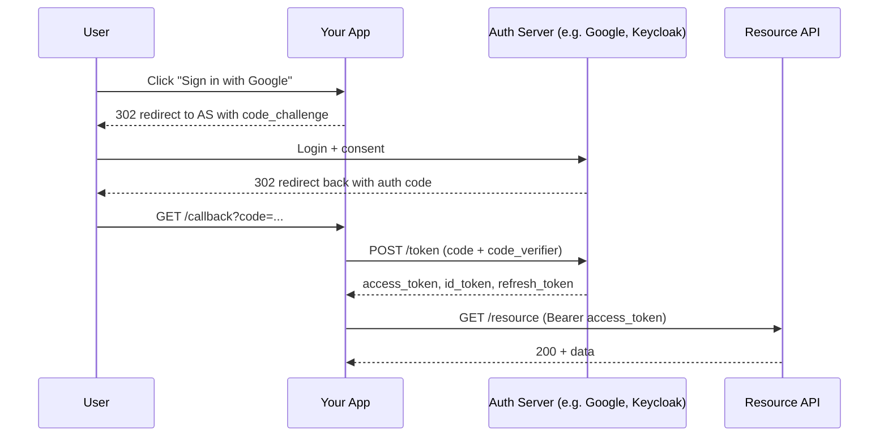

# Spring Security: filter chain, AuthenticationManager, JWT, OAuth2, CSRF, CORS

Spring Security is a **chain of servlet filters** that runs before your controllers. Every request walks through filters that extract credentials, authenticate, set the security context, authorise access, and handle errors. Understanding the chain is the difference between debugging a 401 in seconds versus hours.

## The filter chain



Each filter has one job. Order matters. Custom filters slot in via `addFilterBefore` / `addFilterAfter`.

## Authentication — who are you?

`AuthenticationManager` accepts an `Authentication` object (credentials) and returns an authenticated `Authentication` (principal + authorities) or throws.

The chain stores the authenticated user in the **`SecurityContextHolder`** — a `ThreadLocal` on traditional servlet stacks, request-scoped on reactive stacks. Inside a controller you read it via `@AuthenticationPrincipal` or `SecurityContextHolder.getContext().getAuthentication()`.

```java
@SecurityFilterChain
public SecurityFilterChain api(HttpSecurity http) throws Exception {
    http
        .authorizeHttpRequests(authz -> authz
            .requestMatchers("/public/**").permitAll()
            .requestMatchers("/admin/**").hasRole("ADMIN")
            .anyRequest().authenticated())
        .oauth2ResourceServer(oauth2 -> oauth2.jwt(Customizer.withDefaults()))
        .csrf(csrf -> csrf.disable())                  // stateless API
        .sessionManagement(s -> s.sessionCreationPolicy(STATELESS));
    return http.build();
}
```

## JWT — stateless authentication

A JWT is a signed, base64-encoded JSON token. It carries claims (user id, roles, expiry). The server validates the signature on every request — no session lookup needed.



JWT structure:

```
header.payload.signature
eyJhbGc... . eyJzdWI... . MEQCIH...
```

**JWT pros**: stateless (no session storage), works across services, easy to forward.

**JWT cons**:

- **Cannot be revoked instantly**. Once issued, valid until expiry. Mitigations: short-lived access tokens (5-15 min) + long-lived refresh tokens, or maintain a deny-list.
- **Bigger than a session id** — 1-2 KB on every request.
- **Sensitive data leaks** if you put PII in claims (it is signed, not encrypted, by default).

## OAuth2 — delegated authentication and authorisation

OAuth2 lets a user grant a third-party app access to their resources without sharing credentials. The classic flow is **Authorization Code with PKCE**.



OAuth2 vs OpenID Connect:

- **OAuth2** is about authorisation (can this app access X on the user's behalf?). It returns access tokens.
- **OpenID Connect** is OAuth2 + a standard `id_token` (JWT) describing the authenticated user. Use it when you also need authentication.

## CSRF (Cross-Site Request Forgery) — browser session attack

A malicious site tricks a user's browser into sending a state-changing request to your site. The browser includes the user's cookies, so the request looks legit.

**Defence**: Spring Security adds a CSRF token to forms; the server validates that the token is present and matches what was issued.

```mermaid
sequenceDiagram
    participant Evil as evil.com
    participant Browser
    participant Bank as bank.com
    Evil-->>Browser: HTML with <form action="bank.com/transfer">
    Browser->>Bank: POST /transfer (cookies sent automatically)
    Bank->>Bank: Check CSRF token — missing → reject
    Bank-->>Browser: 403
```



**When to disable CSRF**: stateless APIs that authenticate via `Authorization: Bearer` headers (not cookies). The browser's automatic cookie inclusion is what makes CSRF possible; if you require an explicit header, the attacker cannot forge it cross-origin (same-origin policy).

## CORS (Cross-Origin Resource Sharing) — browser-only access control

A browser **will not** let a page on `evil.com` read responses from `your-api.com` unless the API explicitly opts in via CORS headers.

```java
http.cors(cors -> cors.configurationSource(request -> {
    var config = new CorsConfiguration();
    config.setAllowedOrigins(List.of("https://app.example.com"));
    config.setAllowedMethods(List.of("GET", "POST", "PUT", "DELETE"));
    config.setAllowedHeaders(List.of("Authorization", "Content-Type"));
    config.setAllowCredentials(true);
    return config;
}));
```

**CORS is not authentication.** It only controls which browser origins can read your responses. Other clients (curl, mobile apps, server-to-server) ignore CORS entirely. Authentication and authorisation are separate.

## Method-level security

```java
@PreAuthorize("hasRole('ADMIN')")
public void deleteUser(Long id) { ... }

@PreAuthorize("#userId == authentication.principal.id")
public User getUser(Long userId) { ... }

@PostFilter("filterObject.owner == authentication.principal.id")
public List<Document> myDocuments() { ... }
```

Spring evaluates SpEL expressions against the current authentication. Convenient for fine-grained access checks that depend on arguments or return values.

## Common pitfalls

- **Putting sensitive data in JWT claims**. The token is signed, not encrypted. Anyone with the token can read it.
- **Long-lived JWTs without refresh**. A leaked token is valid until expiry. Use short access tokens + refresh tokens with rotation.
- **Disabling CSRF without understanding why**. CSRF defends cookie-based auth. If your app uses cookies, you almost certainly need CSRF protection.
- **CORS as a security boundary**. CORS controls browser reads. Server-to-server calls bypass it. Always enforce auth on the server.
- **Forgetting to call `super.configure()` or losing default filters** when customising.
- **Setting `permitAll()` on `/error`** but forgetting that errors leak stack traces if `server.error.include-stacktrace=always` is set.
- **Hardcoding secrets** in `application.yml`. Use environment variables, Vault, AWS Secrets Manager, or Spring Cloud Config.

## Interview answers

_Q: Walk me through what happens when a JWT-protected request arrives._
A: The `BearerTokenAuthenticationFilter` extracts the token from the `Authorization` header. The `JwtDecoder` validates the signature against the issuer's public key (cached from JWKS) and checks expiry. The decoded claims become an `Authentication` object stored in the `SecurityContextHolder`. The authorisation filter then checks if the user has the role required for the requested URL.

_Q: How would you implement instant logout for JWT?_
A: Use a token deny-list: on logout, store the token id (`jti` claim) in Redis with TTL equal to the remaining expiry. Every request checks the deny-list before accepting the token. Or use very short access tokens (5 minutes) so the worst-case window is small. The trade-off: deny-list re-introduces server state, defeating one of JWT's selling points.

_Q: When would you pick session-based auth over JWT?_
A: Server-rendered web apps where instant logout matters and the client is always a browser. Sessions also let you store more complex state server-side without bloating every request. JWT shines for SPA + microservices where stateless propagation across services is the goal.

_Q: How does PKCE protect the OAuth2 authorisation code flow?_
A: The client generates a random `code_verifier`, hashes it as `code_challenge`, and sends the challenge with the auth request. The auth server stores it. When the client exchanges the auth code for tokens, it sends the original verifier; the server hashes it and compares. Even if an attacker intercepts the auth code, they cannot exchange it without the verifier, which never leaves the client.

_Q: Why does CORS need preflight (OPTIONS) requests?_
A: For non-simple requests (custom headers, methods other than GET/POST/HEAD, etc.), the browser sends an OPTIONS request first to ask "is this allowed?" The server's response (`Access-Control-Allow-*`) decides. Without preflight, an attacker could fire arbitrary cross-origin requests blindly.

_Q: How would you protect a public API against credential stuffing?_
A: Layer defences. Rate limit per IP and per account. Lock accounts temporarily after N failed attempts. Use bcrypt/argon2 for password hashes (slow). Add CAPTCHA after a few failures. Monitor login telemetry for anomalies (impossible-travel, surge from one ASN). Consider passwordless or WebAuthn for high-value accounts.

_Q: What's the difference between authentication and authorisation?_
A: Authentication answers "who are you?" by verifying credentials. Authorisation answers "what are you allowed to do?" by checking the authenticated principal's roles, permissions, or attribute claims against the resource being accessed.
