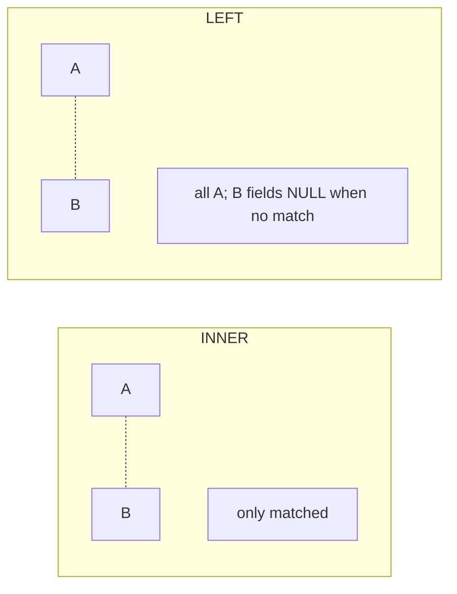
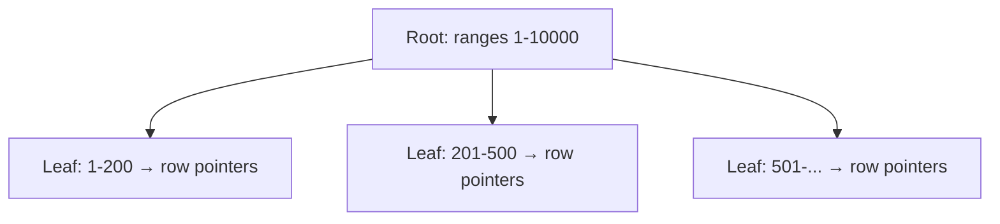

# SQL: joins, subqueries, CTEs, window functions, indexing, EXPLAIN

SQL skill at senior level is not about memorising 50 functions. It is about **reasoning from query shape to execution plan to cost**, and about **knowing how indexes interact with predicates**. The hard problems show up at scale: a `JOIN` that worked at 10K rows takes hours at 10M.

## Joins — the most-asked topic

| Type       | Result                                         |
| ---------- | ---------------------------------------------- |
| INNER JOIN | Matches on both sides only                     |
| LEFT JOIN  | All from left, NULL on the right when no match |
| RIGHT JOIN | Mirror of LEFT                                 |
| FULL OUTER | All rows, NULLs where no match                 |
| CROSS JOIN | Cartesian product (every left × every right)   |



**Classic LEFT JOIN bug**: filtering the right table in `WHERE` turns LEFT into INNER.

```sql
-- WRONG: drops left rows that have no matching right row, because right.deleted_at is NULL for them
SELECT *
FROM users u
LEFT JOIN orders o ON o.user_id = u.id
WHERE o.deleted_at IS NULL;

-- RIGHT: filter in the JOIN condition
SELECT *
FROM users u
LEFT JOIN orders o ON o.user_id = u.id AND o.deleted_at IS NULL;
```

## Subqueries vs CTEs

Common Table Expressions (`WITH`) often read better than nested subqueries.

```sql
-- Nested subquery
SELECT name, total
FROM (
  SELECT user_id, SUM(amount) AS total
  FROM orders
  GROUP BY user_id
) t
JOIN users u ON u.id = t.user_id
WHERE total > 1000;

-- Same with CTE
WITH user_totals AS (
  SELECT user_id, SUM(amount) AS total
  FROM orders
  GROUP BY user_id
)
SELECT name, total
FROM user_totals
JOIN users u ON u.id = user_totals.user_id
WHERE total > 1000;
```

**Performance note**: Postgres ≥ 12 inlines simple CTEs (treats them like subqueries) so cost is similar. Postgres < 12 always materialised. MySQL inlines. Always check the actual plan with `EXPLAIN`.

## Window functions

Window functions compute aggregates **without collapsing rows**. Crucial for "top N per group", "running total", "previous row" patterns.

```sql
-- Rank orders within each user by amount, take top 3
SELECT *
FROM (
  SELECT user_id, id, amount,
         ROW_NUMBER() OVER (PARTITION BY user_id ORDER BY amount DESC) AS rn
  FROM orders
) t
WHERE rn <= 3;

-- Running total of amount over time
SELECT created_at, amount,
       SUM(amount) OVER (ORDER BY created_at) AS running_total
FROM orders;

-- Compare to previous row
SELECT created_at, amount,
       LAG(amount, 1) OVER (ORDER BY created_at) AS previous_amount,
       amount - LAG(amount, 1) OVER (ORDER BY created_at) AS delta
FROM orders;
```

| Function       | Purpose                                  |
| -------------- | ---------------------------------------- |
| `ROW_NUMBER()` | Unique 1-based rank, no ties             |
| `RANK()`       | Ties share rank, gaps after (1, 2, 2, 4) |
| `DENSE_RANK()` | Ties share rank, no gaps (1, 2, 2, 3)    |
| `NTILE(n)`     | Split rows into n buckets                |
| `LAG(col, k)`  | Value k rows before                      |
| `LEAD(col, k)` | Value k rows after                       |
| `FIRST_VALUE`  | First value in the window                |
| `SUM/AVG OVER` | Running aggregations                     |

## Indexing

An index is a data structure (almost always a **B-tree** in Postgres / MySQL) that lets the database find rows by key without scanning the whole table.



### Composite index column order matters

`CREATE INDEX idx ON orders (tenant_id, created_at)`:

| Query                                               | Uses index?               |
| --------------------------------------------------- | ------------------------- |
| `WHERE tenant_id = 5 AND created_at > '2024-01-01'` | Yes                       |
| `WHERE tenant_id = 5`                               | Yes (prefix)              |
| `WHERE created_at > '2024-01-01'`                   | No (skips leading column) |
| `WHERE tenant_id = 5 ORDER BY created_at`           | Yes (no sort needed)      |

The leftmost-prefix rule: a composite index on `(a, b, c)` is usable for queries that filter on `a`, on `(a, b)`, or on `(a, b, c)` — not for queries that only filter on `b` or `c`.

### Index types

| Index type         | Use                                           |
| ------------------ | --------------------------------------------- |
| B-tree (default)   | Equality, range, ORDER BY, prefix LIKE        |
| Hash (Postgres)    | Equality only; rarely used                    |
| GIN                | Full-text search, JSONB, arrays               |
| GiST               | Geospatial, range types, custom orderings     |
| BRIN               | Huge tables sorted by insertion (time-series) |
| Partial            | Index only rows matching a `WHERE` clause     |
| Covering (INCLUDE) | Index-only scans — never visit the table      |

```sql
-- Partial index: only index active orders
CREATE INDEX idx_active_orders ON orders (created_at)
WHERE status = 'ACTIVE';

-- Covering index: avoid visiting the table for a common query
CREATE INDEX idx_orders_user_total ON orders (user_id) INCLUDE (total, status);
```

### Cost of indexes

- **Writes get slower** — every INSERT/UPDATE/DELETE updates every index on the table.
- **Storage cost** — large indexes can be bigger than the table itself.
- **Index maintenance** — bloat over time, especially with frequent updates. Postgres `VACUUM` and rebuilds matter.

## EXPLAIN — read the plan, not the query

Always run `EXPLAIN ANALYZE` on slow queries to see what the database actually does.

```sql
EXPLAIN ANALYZE
SELECT * FROM orders WHERE user_id = 42 AND created_at > '2024-01-01';
```

What to look for:

- **Sequential scan** on a large table → missing index, or filter not selective enough.
- **Bad row estimates** (e.g. estimated 100, actual 1M) → stale statistics. Run `ANALYZE`.
- **Sort operations** that spill to disk → memory tuning or matching index for `ORDER BY`.
- **Nested loop** over a large outer set → consider hash join or merge join.
- **Index scan** but huge `Filter` removed afterwards → first index column is not selective enough.

## Common pitfalls

- **`SELECT *`**. Loads columns you don't need; prevents index-only scans. Always select specific columns.
- **`WHERE column LIKE '%foo'`**. Leading wildcard cannot use a B-tree index. Use full-text indexes or trigram (`pg_trgm`) for substring search.
- **`WHERE function(column) = ...`**. Wraps the column in a function, the index can't be used. Either index the expression (`CREATE INDEX ON t (lower(name))`) or rewrite the query.
- **N+1 in app code**. The DB is fine; the app is the problem. See JPA topic.
- **Implicit type conversion**. `WHERE varchar_col = 5` may force a full scan because Postgres has to coerce every row. Match types explicitly.
- **Missing `LIMIT` on user-facing queries**. One bad input that returns 10M rows takes the service down.
- **Using `OFFSET` for deep pagination**. `OFFSET 1000000 LIMIT 20` skips 1M rows. Use **keyset pagination** (`WHERE created_at < :last AND id < :lastId LIMIT 20`) for O(log n) skip.

## Interview answers

_Q: When would you choose a CTE over a subquery?_
A: For multi-step transformations and readability. CTEs let you name and chain steps clearly. Performance is similar in modern Postgres; in older databases CTEs were always materialised, which sometimes hurt. Always check the plan if performance matters.

_Q: How does a B-tree index find a row?_
A: Walk from the root down to a leaf, comparing keys at each level — `O(log n)` page reads. The leaf points to the heap location. For range queries, the leaves are linked, so you can scan sequentially.

_Q: What is an index-only scan?_
A: When the index covers all columns needed by the query, the database does not need to visit the table — the answer is fully built from the index. Big speedup for read-heavy workloads. Use `INCLUDE` columns or covering indexes to enable it.

_Q: How would you find the top 3 highest-paid employees per department?_
A: Window function: `ROW_NUMBER() OVER (PARTITION BY department ORDER BY salary DESC) AS rn`, then filter `WHERE rn <= 3` in an outer query. Beats GROUP BY + correlated subquery for clarity and speed.

_Q: When is sequential scan actually the right plan?_
A: Small tables (the planner ignores indexes when seq scan is fast enough), or selective queries where almost every row matches the filter (an index walk + heap visit costs more than scanning). Both are correct optimiser decisions.

_Q: How would you optimise `OFFSET 1000000 LIMIT 20`?_
A: Switch to keyset pagination. Order by an indexed column with a unique tiebreaker (`ORDER BY created_at DESC, id DESC`). Page through using `WHERE (created_at, id) < (:lastCreated, :lastId)`. The query reads only 20 rows from an index seek, not 1M.

_Q: What's the difference between `RANK` and `DENSE_RANK`?_
A: With ties, `RANK` leaves gaps (1, 2, 2, 4); `DENSE_RANK` does not (1, 2, 2, 3). Use `DENSE_RANK` when you want compact ranks, `RANK` when you want positions to reflect "skipped" places.

_Q: How would you reduce write amplification on a hot table with many indexes?_
A: Audit each index. Drop ones not used by any query (Postgres has `pg_stat_user_indexes`). Convert overlapping single-column indexes into one composite. Consider partial indexes if writes mostly affect rows outside a `WHERE` predicate. Or split the hot table into a "hot" recent partition and a "cold" historical one.
