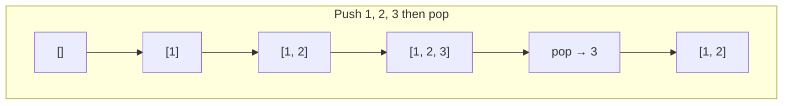
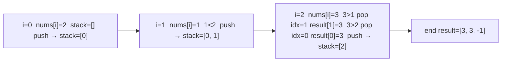

# Stacks: expression evaluation, monotonic stack, min-stack

A stack is a "last in, first out" container. Push to the top, pop from the top. That is all. The power comes from what you choose to push: a number, a character, an unresolved problem, an index. In interviews, stacks usually encode **the last thing you have not finished yet**.



In Java: `Deque<Integer> stack = new ArrayDeque<>()` (do not use `Stack` — it is a legacy synchronized class).

## 1. Balanced parentheses

The classic stack problem: check if a string of `()`, `[]`, `{}` is balanced.

```java
boolean isValid(String s) {
    Deque<Character> stack = new ArrayDeque<>();
    Map<Character, Character> match = Map.of(')', '(', ']', '[', '}', '{');
    for (char c : s.toCharArray()) {
        if (match.containsValue(c)) stack.push(c);
        else if (stack.isEmpty() || stack.pop() != match.get(c)) return false;
    }
    return stack.isEmpty();
}
```

The invariant: at every position, the stack holds the open brackets we have not yet closed. A close bracket must match the top.

## 2. Expression evaluation

Postfix expressions (`3 4 + 2 *`) are easy because operators come after their operands.

```java
int evalPostfix(String[] tokens) {
    Deque<Integer> stack = new ArrayDeque<>();
    for (String tok : tokens) {
        if ("+-*/".contains(tok)) {
            int b = stack.pop(), a = stack.pop();
            switch (tok) {
                case "+" -> stack.push(a + b);
                case "-" -> stack.push(a - b);
                case "*" -> stack.push(a * b);
                case "/" -> stack.push(a / b);
            }
        } else {
            stack.push(Integer.parseInt(tok));
        }
    }
    return stack.pop();
}
```

For infix (`3 + 4 * 2`) you need two stacks (operands and operators) plus precedence handling, or you convert infix to postfix first using the **shunting-yard algorithm**.

## 3. Monotonic stack — next greater element

This is the most-tested stack pattern at senior level. The stack holds elements (or indices) in **increasing or decreasing** order. Whenever a new element breaks that order, pop until it fits — and **the popped elements know their answer**.

Problem: for each `nums[i]`, find the next element to its right that is larger than `nums[i]`. Return `-1` if none.

```java
int[] nextGreater(int[] nums) {
    int n = nums.length;
    int[] result = new int[n];
    Arrays.fill(result, -1);
    Deque<Integer> stack = new ArrayDeque<>();  // stack of indices
    for (int i = 0; i < n; i++) {
        while (!stack.isEmpty() && nums[stack.peek()] < nums[i]) {
            int idx = stack.pop();
            result[idx] = nums[i];
        }
        stack.push(i);
    }
    return result;
}
```

Walk through `[2, 1, 3]`:



The same skeleton solves: previous-smaller, daily temperatures, stock span, largest rectangle in histogram, trapping rain water, online min/max queries.

**Why it is `O(n)`**: every index is pushed once and popped at most once. The inner `while` looks scary but does not break the linear bound.

## 4. Min-stack — `getMin` in `O(1)`

The problem: a stack that supports `push`, `pop`, `top`, and `getMin`, all in `O(1)`.

The trick: each entry stores the value **and the running minimum at that moment**.

```java
class MinStack {
    private final Deque<int[]> stack = new ArrayDeque<>();  // [value, currentMin]

    public void push(int val) {
        int min = stack.isEmpty() ? val : Math.min(val, stack.peek()[1]);
        stack.push(new int[] { val, min });
    }
    public void pop() { stack.pop(); }
    public int top() { return stack.peek()[0]; }
    public int getMin() { return stack.peek()[1]; }
}
```

A second stack of minimums works too. Both are `O(n)` extra space.

## 5. Recursion is a stack

Every recursive call pushes a frame on the call stack: locals, return address, parameters. Converting recursion to iteration almost always means **manually maintaining your own stack**. This is how you avoid stack-overflow errors on deep trees.

```java
// Iterative DFS — manual stack
void dfs(Node root) {
    Deque<Node> stack = new ArrayDeque<>();
    stack.push(root);
    while (!stack.isEmpty()) {
        Node node = stack.pop();
        process(node);
        if (node.right != null) stack.push(node.right);
        if (node.left != null) stack.push(node.left);  // pushed last → popped first
    }
}
```

## Common mistakes

- **Using Java's `java.util.Stack`**. It extends `Vector` and is synchronized. Slower than `ArrayDeque` and not recommended in modern code.
- **Pushing values when you needed to push indices**. For monotonic-stack problems where the answer is "what index does this resolve to," push indices and look up values when needed.
- **Popping from an empty stack**. Always check `isEmpty()` before pop in problems with malformed input.
- **Forgetting to drain the stack at the end**. After the main loop, items still on the stack often need their answer set to a default (`-1`, `n`, etc.) because no future element resolved them.

## Interview answers

_Q: Why is the monotonic-stack pattern `O(n)` even with a nested `while` loop?_
A: Each index is pushed exactly once and popped at most once across the entire run. The total work in the inner `while` summed across all outer iterations is bounded by `n`. So total work is `O(n)`, not `O(n²)`.

_Q: When would you reach for a stack instead of a queue?_
A: Whenever order of resolution matters and the most recently seen item should be processed first. Examples: parsing nested structures (HTML, JSON, parentheses), undo history, depth-first search, expression evaluation, backtracking.

_Q: How would you implement a queue using two stacks?_
A: Two stacks `in` and `out`. Push goes to `in`. Pop transfers everything from `in` to `out` (only when `out` is empty), then pops from `out`. Each element moves between stacks at most once, so amortized `O(1)`.

_Q: Walk me through trapping rain water with a stack._
A: Maintain a decreasing monotonic stack of indices by height. When you see a height taller than the stack top, you have a "valley." Pop the top as the floor, peek at the new top as the left wall, and the current index is the right wall. Trapped water above the floor is `min(left, right) - floor` times the width.

_Q: What is the difference between `ArrayDeque` and `LinkedList` as a stack?_
A: `ArrayDeque` uses a resizable circular array. Better cache locality, no per-element allocation overhead, faster in practice for almost every workload. `LinkedList` allocates a node per push. Use `ArrayDeque`.
