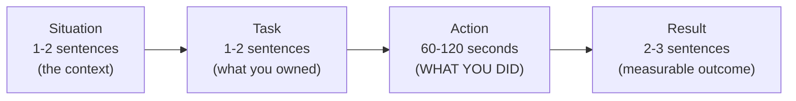
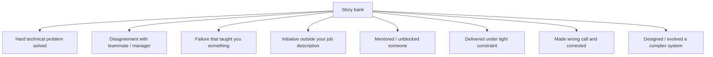
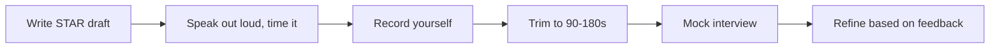

# STAR method: Situation, Task, Action, Result; story bank construction

Senior interviews are won and lost in non-coding rounds. The bar shifts from "can you do the work?" to "**can you operate autonomously, scope the right work, raise the right concerns, and influence outcomes when you do not have authority?**"

This module is for the rounds you cannot grind on LeetCode. The good news: behavioural questions have predictable shapes, and you can prepare.

## STAR — the universal answer structure

| Stage     | Question to answer                | Length                   |
| --------- | --------------------------------- | ------------------------ |
| Situation | What was the context?             | 1-2 sentences            |
| Task      | What was the problem you owned?   | 1-2 sentences            |
| Action    | **What did you do specifically?** | 60-120 seconds, the bulk |
| Result    | What was the measurable outcome?  | 2-3 sentences            |

**The biggest mistake is drowning in Situation.** Interviewers want to hear what **you** did. Compress the setup; expand the action.

A well-delivered STAR story takes **90-180 seconds**. Longer and you lose the room; shorter and the action feels thin.

## Weak vs strong STAR — side by side

**Weak**:

> "We had performance issues so we improved the queries and it got better."

This is no story. No numbers. No specific action. No evidence the speaker drove it.

**Strong**:

> "Our checkout API's p99 latency had drifted from 250ms to 1.4s over six months and was causing 3-4% drop-off at payment.
>
> _(Situation)_
>
> I was asked to lead the investigation.
>
> _(Task)_
>
> I instrumented the request path with OpenTelemetry, identified that 80% of latency came from one N+1 query in our line-item loader, replaced it with a batch fetch, and added a regression test using a Testcontainers Postgres fixture. I also added a Grafana alert tied to the p99 SLO so we'd catch a similar regression earlier next time.
>
> _(Action)_
>
> p99 went from 1.4s to 280ms. Drop-off recovered within two days. The alert caught a related regression six weeks later, which we fixed before customers noticed.
>
> _(Result)_"

The strong version contains:

- **Specific numbers** (250ms → 1.4s → 280ms; 3-4% drop-off).
- **Specific tools** (OpenTelemetry, Testcontainers, Grafana).
- **Specific technical action** (N+1 → batch fetch).
- **A second-order improvement** (alert that caught a future regression).
- **An owned, individual contribution** (not "we").

The strong version is roughly 110 seconds spoken — perfect length.

## The story bank

Maintain **6-8 stories** that together cover all common behavioural questions. Each story should map to multiple competencies so you can re-use them across questions.

### Required coverage

For each, write a STAR draft:

- Situation: 1-2 sentences.
- Task: 1-2 sentences.
- Action: bulleted technical specifics.
- Result: numbers, dates, follow-ups.

Practise out loud. The first delivery is always rough; by the third, it flows.

## Common behavioural questions and which story to pull

| Question                                                 | Story type                             |
| -------------------------------------------------------- | -------------------------------------- |
| "Tell me about a time you took initiative."              | Initiative                             |
| "Tell me about a hard technical problem."                | Hard technical                         |
| "Tell me about a conflict with a coworker."              | Disagreement                           |
| "Tell me about a project that failed."                   | Failure                                |
| "How do you handle pressure?"                            | Tight constraint                       |
| "Tell me about a time you mentored someone."             | Mentoring                              |
| "Tell me about a time you influenced without authority." | Disagreement / Initiative              |
| "How do you handle ambiguity?"                           | Initiative + scoping                   |
| "Tell me about a time you made the wrong call."          | Wrong call                             |
| "Tell me about a system you designed."                   | Complex system                         |
| "How do you handle technical debt?"                      | Wrong call (refactor) / hard technical |
| "What is your biggest weakness?"                         | Failure (with growth)                  |

## Calibrating story difficulty to the role level

| Level           | Story scope                                                     |
| --------------- | --------------------------------------------------------------- |
| Mid (L4)        | One project, your direct contribution                           |
| Senior (L5)     | Multi-feature project, technical leadership, code review impact |
| Staff (L6)      | Cross-team initiative, system-level change, org-wide pattern    |
| Principal (L7+) | Strategic shift, multi-quarter impact, mentorship at scale      |

Use stories with appropriate scope. A staff candidate telling a "I implemented a feature" story sounds junior; a mid candidate claiming "I rearchitected the company" sounds inflated.

## Numbers to include if you can

- Latency / throughput before and after.
- Number of users affected.
- Dollar impact (revenue, cost saved, infra cost reduced).
- Time saved (deploy frequency, build time, on-call pages).
- Test coverage, error rate.
- Team size you led or influenced.

If you do not have exact numbers, **estimate honestly**: "around 200 customers", "approximately 30% reduction." Vague is fine; lying is fatal — interviewers ask follow-ups.

## Mapping a single story to multiple competencies

Take a story about migrating a legacy auth system. Same Action paragraph; tailored Result to fit different questions:

| Question asked           | Result emphasis                                                                                                       |
| ------------------------ | --------------------------------------------------------------------------------------------------------------------- |
| "Hard technical problem" | "Migrated 50M users with zero downtime; eliminated XSS class via cookie flag."                                        |
| "Disagreement"           | "Initially proposed gradual rollout; PM wanted big-bang. I ran a doc with three risk scenarios; we agreed on canary." |
| "Mentoring"              | "Onboarded two engineers to OAuth flows during the project; one led the next migration."                              |
| "Initiative"             | "Noticed the auth code had no integration tests; spent a week adding them before the migration."                      |

One project, four answers.

## Common pitfalls

- **"We" instead of "I"**. Interviewers want individual contribution. "I led" or "I owned X while the team owned Y."
- **Drowning in Situation**. 30 seconds of context, not 90.
- **No numbers**. Vague results sound made up.
- **Picking the same hero story for every question**. The interviewer notices and probes for breadth.
- **Hypothetical scenarios**. "I would do X" is not a story. Use real events.
- **No follow-up effect**. A great story includes what changed afterward — alert that caught the next regression, doc that helped onboarding, pattern adopted by other teams.
- **Reading from notes**. STAR sounds rehearsed when read; flowing when practised. Memorise the shape, not the words.

## Practising

Speak each story out loud at least 3 times before the interview. Time it. Most candidates' stories run too long; trimming is the main edit.

Mock interviews with a peer or paid service (interviewing.io, prepfully) catch what self-rehearsal misses.

## Interview answers

_Q: How do you choose which story to tell for a given question?_
A: Map each story in your bank to 2-3 competencies upfront. When the question comes, pick the story whose strongest competency matches. If multiple fit, pick the most recent — interviewers prefer current relevance.

_Q: How do I handle the "tell me about a failure" question without sounding bad?_
A: Pick a real failure with a clear lesson and a follow-up where you applied the lesson. Example: shipped a feature without proper rollout monitoring → caught regression late → built dashboards for next launches → next launch caught issue at 1% rollout. The arc is failure → learning → applied → better outcome.

_Q: What if my failure story makes me look incompetent?_
A: Pick failures of judgement or process, not core skill. "I underestimated the data migration complexity" is fine. "I deleted production" is too far. The lesson must be transferable and one a senior can credibly have.

_Q: How long should a STAR answer be?_
A: 90-180 seconds. Faster sounds rehearsed and thin. Longer loses attention. Most people's stories run too long because Situation drags. Compress setup, expand action.

_Q: How do I handle "tell me about your biggest weakness"?_
A: Real weakness + how you compensate. "I tend to prefer technical depth over breadth — I sometimes over-research a problem when a faster decision would do. I now timebox investigations: 2 days max before I write up findings and decide." Avoid humble-brag ("I work too hard") — interviewers roll their eyes.

_Q: Should I tell the same story I told another interviewer at the same company?_
A: If the story is strong and fits the new question, yes. Different interviewers usually do not compare detailed notes; they compare overall signal. Tailor the angle to the question.

_Q: How do I deal with an interviewer who interrupts or asks follow-ups mid-story?_
A: Pause, answer the follow-up directly, then signal back: "to your earlier question, the result was..." Interviewers asking follow-ups means they are engaged — that's good. Stay flexible; do not insist on finishing your prepared script.
