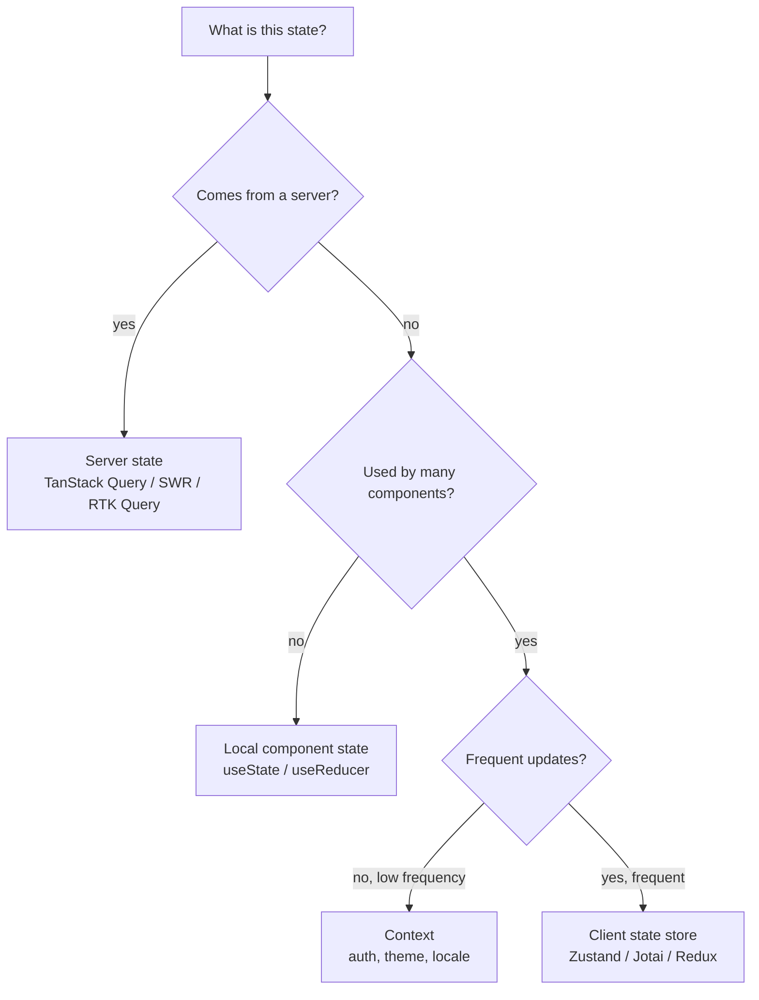
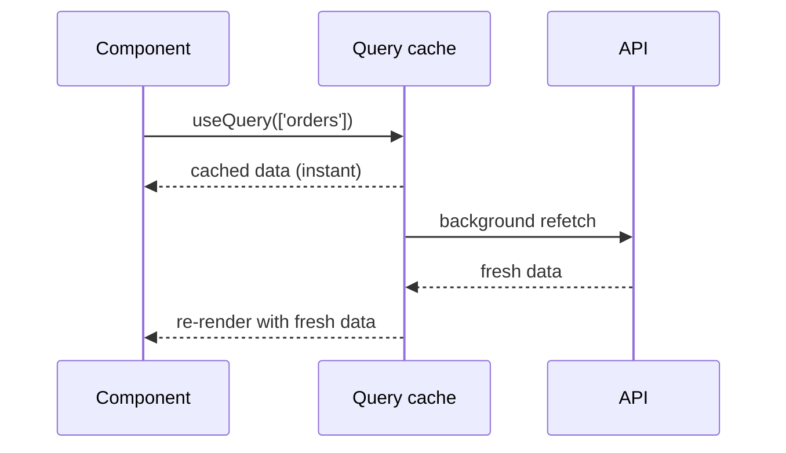

# State management: TanStack Query, Redux Toolkit, Zustand, Context API

The biggest skill in modern React state management is **deciding what kind of state you have** and putting it in the right place. There is no single "best" library — different problems need different tools, and modern apps usually combine several.

## Three kinds of state



Most apps mix all three:

| Kind          | Examples                                     | Tool                                    |
| ------------- | -------------------------------------------- | --------------------------------------- |
| Local         | Form input, toggle state, current tab        | `useState`, `useReducer`                |
| Server        | User profile, list of orders, search results | TanStack Query, SWR, RTK Query          |
| Global client | Auth user, theme, feature flags, cart        | Context (low freq), Zustand (high freq) |

The classic mistake: putting server state in a Redux store and writing your own caching, refetch, and stale logic. Use a query library — they have already solved it.

## Server state — TanStack Query

```jsx
import { useQuery, useMutation, useQueryClient } from '@tanstack/react-query'

function OrderList() {
  const { data, isLoading, error } = useQuery({
    queryKey: ['orders'],
    queryFn: () => fetch('/api/orders').then(r => r.json()),
  })

  if (isLoading) return <Spinner />
  if (error) return <Error error={error} />
  return <List items={data} />
}

function CancelOrderButton({ id }: { id: string }) {
  const queryClient = useQueryClient()
  const mutation = useMutation({
    mutationFn: () => fetch(`/api/orders/${id}`, { method: 'DELETE' }),
    onSuccess: () => queryClient.invalidateQueries({ queryKey: ['orders'] }),
  })
  return <button onClick={() => mutation.mutate()}>Cancel</button>
}
```

TanStack Query handles:

- **Caching** — query results live in a cache keyed by `queryKey`. Multiple components asking for `['orders']` share the cache.
- **Background refetching** — refetch on window focus, network reconnect, on a polling interval.
- **Stale-while-revalidate** — serve cached data instantly, fetch in background, swap in fresh.
- **Mutations + invalidation** — after a mutation, invalidate dependent queries so they refetch.
- **Loading and error states** — first-class, no boilerplate.
- **Optimistic updates** — apply the change locally before the server confirms.



**Rule of thumb**: anything that comes from `fetch` should be in a query library, not in component state or a global store.

## Client state stores

For UI-only state shared across the app — sidebars, modals, drawer state, draft forms, multi-step wizards — pick a small store.

### Zustand

Tiny, no-context, hook-based.

```jsx
import { create } from 'zustand'

const useStore = create((set) => ({
  sidebarOpen: false,
  toggleSidebar: () => set((state) => ({ sidebarOpen: !state.sidebarOpen })),
}))

function Sidebar() {
  const sidebarOpen = useStore((state) => state.sidebarOpen)
  return sidebarOpen ? <SidebarContent /> : null
}

function ToggleButton() {
  const toggle = useStore((state) => state.toggleSidebar)
  return <button onClick={toggle}>Toggle</button>
}
```

**Why Zustand wins for many cases**:

- Selectors — components subscribe to slices, not the whole store. Less re-render churn than Context.
- No provider needed.
- Tiny API, ~3 KB.
- Works with middleware (persist, devtools, immer).

### Jotai — atom-based

Each piece of state is an "atom"; components subscribe to atoms they read.

```jsx
import { atom, useAtom } from 'jotai'

const sidebarAtom = atom(false)
const userAtom = atom({ id: 1, name: 'Alice' })
const greetingAtom = atom((get) => `Hi ${get(userAtom).name}`)

function Greeting() {
  const [greeting] = useAtom(greetingAtom)
  return <p>{greeting}</p>
}
```

Good for derived state. Conceptually clean. Used heavily in design systems.

## Redux Toolkit — when you actually need it

Redux Toolkit (RTK) is the modern, less-boilerplate Redux. Worth using when:

- Your team is large and "the state machine of every action" matters for debugging.
- You need time-travel debugging across complex flows.
- You enforce strict architectural boundaries via slice files.
- You already use it and it works.

```jsx
import { createSlice, configureStore } from '@reduxjs/toolkit'

const cartSlice = createSlice({
  name: 'cart',
  initialState: { items: [] },
  reducers: {
    add: (state, action) => {
      state.items.push(action.payload)
    }, // Immer makes mutation safe
    remove: (state, action) => {
      state.items = state.items.filter((i) => i.id !== action.payload)
    },
  },
})

export const { add, remove } = cartSlice.actions
export const store = configureStore({ reducer: { cart: cartSlice.reducer } })
```

For most new apps under modest complexity, Zustand or Jotai with TanStack Query is faster to ship and maintain.

## Context — dependency injection, not state

Context shines for:

- Auth user (rarely changes after login).
- Theme.
- Locale and translations.
- Feature flags.
- Configuration.

It is **not** great for:

- Frequently-changing state (cart with many items, hover state, scroll position) — every consumer re-renders on any value change.
- Cross-tree shared mutable data with selectors.

```jsx
const ThemeContext = (createContext < 'light') | ('dark' > 'light')

function App() {
  const [theme, setTheme] = useState('light')
  const value = useMemo(() => ({ theme, setTheme }), [theme]) // stable reference
  return (
    <ThemeContext.Provider value={value}>
      <Routes />
    </ThemeContext.Provider>
  )
}
```

If consumers re-render too often, **split contexts** by what changes together.

## State colocation — keep state close

The first question to ask before reaching for any library: **does this state really need to be shared, or can it live in a single component?**

```jsx
// BAD — modal state lifted unnecessarily
function App() {
  const [showModal, setShowModal] = useState(false)
  return (
    <>
      <Header onShowModal={() => setShowModal(true)} />
      <Modal open={showModal} onClose={() => setShowModal(false)} />
    </>
  )
}

// GOOD — colocate state next to the trigger
function HeaderWithModal() {
  const [showModal, setShowModal] = useState(false)
  return (
    <>
      <button onClick={() => setShowModal(true)}>Open</button>
      <Modal open={showModal} onClose={() => setShowModal(false)} />
    </>
  )
}
```

The lesson: **lift state only when more than one component needs it**. Premature lifting causes everything above to re-render on every modal toggle.

## URL as state

For state that should be shareable, bookmarkable, or persistent across reloads — search filters, pagination, selected tab — store it in the URL.

```jsx
const [searchParams, setSearchParams] = useSearchParams()
const tab = searchParams.get('tab') ?? 'overview'

<Tabs value={tab} onChange={(t) => setSearchParams({ tab: t })} />
```

URL state is free persistence, free shareability, and works across deployments.

## Common pitfalls

- **Putting server data in Redux**. You will rebuild caching, refetch, and stale logic from scratch. Use TanStack Query.
- **Single global state for everything**. Forces every interaction through one store, kills tree-locality, makes refactoring painful.
- **Context for high-frequency state**. Re-renders every consumer. Use a store with selectors.
- **Overlifting state**. Hoisting modal toggle to the app root because it might be needed elsewhere later. Lift when the need is real, not when imagined.
- **Reading state during render and not updating when it changes**. Subscribe via the proper hook (`useStore`, `useQuery`); do not access store internals directly.
- **Mutating state inside Zustand or Redux without Immer**. Without Immer, mutating state silently breaks. Either replace fully or wrap with Immer.

## Interview answers

_Q: When would you reach for Redux Toolkit over Zustand?_
A: Large teams that benefit from a single architectural pattern, time-travel debugging, or already-existing Redux investment. For most new apps with modest complexity, Zustand + TanStack Query is faster to ship and easier to maintain.

_Q: How does TanStack Query reduce server state pain?_
A: It abstracts caching, refetch policies, stale-while-revalidate, optimistic updates, retry logic, and error states behind a `useQuery` hook. Without it, every team writes a worse version of these features by hand. The pattern is so universally needed that it should not be in component code.

_Q: Why is Context not a state management library?_
A: It is a transport mechanism. The state still has to live somewhere, and Context's coarse re-render model — every consumer re-renders on every value change — does not scale to high-frequency updates. It is great for low-frequency global values but a poor fit for cart-state-style problems.

_Q: How would you decide between local state and a store?_
A: Start local. Lift to a store only when (a) two or more sibling components need the same state, and (b) prop-drilling becomes painful. Premature lifting is more expensive than late lifting because everything in between gets coupled.

_Q: What's wrong with putting `useState` for a search result list inside a component?_
A: It loses caching when navigating away and back, refetches on every mount, has no background-refresh logic, and forces every component using the same data to fetch independently. Use `useQuery` so multiple components share the cache and you get refresh, retry, and dedup for free.

_Q: How do you persist state across reloads?_
A: For server state, the server is the source of truth — refetch on mount. For client state, persist explicitly: Zustand has a `persist` middleware that writes to localStorage. For sharing across tabs, use `BroadcastChannel` or storage events. For shareable URLs, use the URL itself.

_Q: When would you split contexts?_
A: When some consumers care about a fast-changing slice and others care about a rarely-changing slice. Putting both in one context makes everyone re-render when either changes. Splitting `<UserContext>` and `<ThemeContext>` so theme changes don't re-render user-only components.
