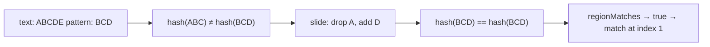

# Strings: KMP, Rabin-Karp, Z-Algorithm, Manacher

Strings are arrays of characters. The naive way to search for a pattern in a text — try every starting position, compare character by character — runs in `O(n * m)` where `n` is the text length and `m` is the pattern length. The four algorithms below all bring it down to `O(n + m)` by reusing work from previous comparisons.

You will rarely have to code these from memory in an interview. You **will** have to explain the core idea and the time complexity. The hard part is the intuition, not the code.

| Algorithm   | Time                          | Best for                                        |
| ----------- | ----------------------------- | ----------------------------------------------- |
| KMP         | `O(n + m)`                    | Single pattern in a single text                 |
| Rabin-Karp  | `O(n + m)` avg, `O(nm)` worst | Many patterns, finding duplicates, plagiarism   |
| Z-algorithm | `O(n + m)`                    | Prefix questions, periodicity, simpler than KMP |
| Manacher    | `O(n)`                        | Longest palindromic substring                   |

## The naive baseline

```java
int naive(String text, String pattern) {
    int n = text.length(), m = pattern.length();
    for (int i = 0; i <= n - m; i++) {
        int j = 0;
        while (j < m && text.charAt(i + j) == pattern.charAt(j)) j++;
        if (j == m) return i;
    }
    return -1;
}
```

The wasted work: when `pattern = "ABABC"` matches `"ABAB"` and fails at `C`, naive search restarts from position `i + 1`. But we already know positions `i + 1` and `i + 2` cannot start a full match — we **proved** it during the failed comparison.

## KMP — Knuth-Morris-Pratt

KMP precomputes an **LPS table** (Longest Proper Prefix that is also a Suffix). For pattern `"ABABC"`:

```
pattern : A B A B C
index   : 0 1 2 3 4
lps     : 0 0 1 2 0
```

Read `lps[3] = 2` as: "the substring `ABAB` (pattern[0..3]) has a length-2 prefix `AB` that also appears as a suffix." When a mismatch happens at index 4, we do not restart — we shift the pattern by `m - lps[m-1]` and keep the text pointer where it was.

```java
int[] buildLps(String pattern) {
    int m = pattern.length();
    int[] lps = new int[m];
    int len = 0;
    for (int i = 1; i < m; ) {
        if (pattern.charAt(i) == pattern.charAt(len)) {
            lps[i++] = ++len;
        } else if (len > 0) {
            len = lps[len - 1];
        } else {
            lps[i++] = 0;
        }
    }
    return lps;
}

int kmp(String text, String pattern) {
    int[] lps = buildLps(pattern);
    int n = text.length(), m = pattern.length();
    int i = 0, j = 0;
    while (i < n) {
        if (text.charAt(i) == pattern.charAt(j)) {
            i++; j++;
            if (j == m) return i - m;
        } else if (j > 0) {
            j = lps[j - 1];
        } else {
            i++;
        }
    }
    return -1;
}
```

The text pointer `i` only moves forward. That is why KMP is `O(n + m)`.

## Rabin-Karp — rolling hash

Rabin-Karp slides a window of length `m` over the text and compares its hash to the pattern hash. The trick is the **rolling hash**: hash of window `[i+1, i+m]` is computed from hash of window `[i, i+m-1]` in `O(1)`, not `O(m)`.

```java
int rabinKarp(String text, String pattern) {
    int n = text.length(), m = pattern.length();
    if (m > n) return -1;
    long base = 256, mod = 1_000_000_007L;
    long pHash = 0, tHash = 0, power = 1;
    for (int i = 0; i < m; i++) {
        pHash = (pHash * base + pattern.charAt(i)) % mod;
        tHash = (tHash * base + text.charAt(i)) % mod;
        if (i < m - 1) power = (power * base) % mod;
    }
    for (int i = 0; i <= n - m; i++) {
        if (pHash == tHash && text.regionMatches(i, pattern, 0, m)) return i;
        if (i < n - m) {
            tHash = (tHash - text.charAt(i) * power % mod + mod * mod) % mod;
            tHash = (tHash * base + text.charAt(i + m)) % mod;
        }
    }
    return -1;
}
```

The `regionMatches` call is the **collision check**. Hashes can collide; matching hashes guarantee nothing. For most inputs collisions are rare, so average time stays linear.



Rabin-Karp shines when you search for **many patterns at once** (precompute pattern-set hashes) or for **near-duplicate detection** (Rabin fingerprints in plagiarism checkers).

## Z-algorithm — prefix matches

The Z-array `z[i]` is the length of the longest substring starting at `i` that matches the **prefix** of the same string. For `"aabaab"`:

```
i      : 0 1 2 3 4 5
char   : a a b a a b
z      : - 1 0 3 1 0
```

`z[3] = 3` because `"aab"` (starting at index 3) equals the first 3 characters `"aab"`.

To search for `pattern` in `text`, build the Z-array of `pattern + "$" + text` and look for any `z[i] == pattern.length()`. The `$` separator stops matches from spanning the boundary.

```java
int[] zArray(String s) {
    int n = s.length();
    int[] z = new int[n];
    int l = 0, r = 0;
    for (int i = 1; i < n; i++) {
        if (i < r) z[i] = Math.min(r - i, z[i - l]);
        while (i + z[i] < n && s.charAt(z[i]) == s.charAt(i + z[i])) z[i]++;
        if (i + z[i] > r) { l = i; r = i + z[i]; }
    }
    return z;
}
```

Z is often easier to derive on a whiteboard than KMP. The mental model: maintain the rightmost known match box `[l, r]`; everything inside the box can be answered in `O(1)` from a previously computed `z[i - l]`.

## Manacher — all palindromic substrings

Brute force on "longest palindromic substring" is `O(n²)`: try every center, expand outwards. Manacher uses **mirror symmetry** around a previously found palindrome to skip work, achieving `O(n)`.

The trick is to handle even-length and odd-length palindromes uniformly by inserting a separator character between every pair: `"abba"` becomes `"^#a#b#b#a#$"`. Then every palindrome (odd or even in the original) has odd length here.

For interviews, you almost never need to code Manacher live. Knowing the concept — "expand around center is `O(n²)`, Manacher reuses prior radii via mirroring for `O(n)`" — is enough. Senior interviews will accept the `O(n²)` expand-around-center for clarity.

## Common mistakes

- **String concatenation in a loop**. `s += c` inside a hot loop is `O(n²)` in Java. Use `StringBuilder`.
- **Forgetting Unicode**. `charAt` returns 16-bit `char`; surrogate pairs (emoji, some CJK) span two `char`s. If the problem allows full Unicode, iterate over code points.
- **Comparing strings with `==` in Java**. Always use `equals`. The `==` works only for interned literal strings.
- **Off-by-one on inclusive vs exclusive ranges**. KMP indices `[i, j]` and rolling-hash window edges trip people up. Pick a convention (inclusive-exclusive is safer) and stick to it.

## Interview answers

_Q: Why does KMP keep the text pointer from moving backward?_
A: When a mismatch happens at pattern index `j`, the LPS table tells us the longest prefix of the pattern that is also a suffix of what we already matched. Shifting the pattern by `j - lps[j-1]` lets us reuse that prefix as the new starting overlap, so the text pointer never has to revisit characters.

_Q: When would you choose Rabin-Karp over KMP?_
A: When searching for many patterns in the same text (hash all patterns once, slide one window) or when the hash itself is the answer (duplicate-detection, content addressing). KMP is single-pattern only without modification.

_Q: How do you avoid hash collisions in Rabin-Karp?_
A: Two strategies. First, double-hashing: maintain two rolling hashes with different `(base, mod)` pairs and require both to match. Second, always run a literal `regionMatches` after a hash hit. The literal check makes the algorithm correct even if the hash function is weak; the hash just makes the average case fast.

_Q: How would you find all occurrences of a pattern (not just the first)?_
A: In KMP, when `j == m`, instead of returning, set `j = lps[m - 1]` and keep scanning. The LPS jump positions you correctly to find overlapping matches as well.

_Q: Where do these algorithms show up in real systems?_
A: KMP and Aho-Corasick (a multi-pattern KMP) power `grep` and intrusion-detection systems. Rabin-Karp powers `git`-like content addressing and rsync's rolling-checksum diff. Z-array shows up in suffix-array construction. Manacher rarely shows up in production but is a common interview question for FAANG-tier problems.
