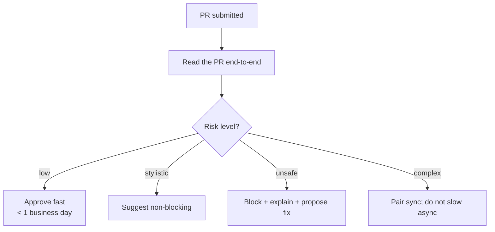
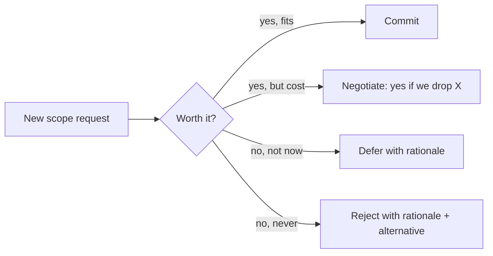
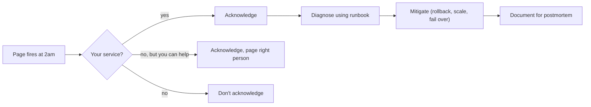

# Technical leadership: code reviews, mentoring, scope management, on-call ownership

Senior is the level where the question shifts from "can you do the work?" to "**can you make others around you more effective?**" Technical leadership is the bundle of behaviours that makes that visible: how you review, how you mentor, how you push back on scope, how you handle production ownership.

You do not need a manager title to lead technically. You need to be the person whose judgement other engineers trust.

## Code reviews — the daily form of leadership

| Severity | Examples                                                 | Action                                 |
| -------- | -------------------------------------------------------- | -------------------------------------- |
| Block    | Security flaw, data loss, missing tests on critical path | Comment with "blocking:" + propose fix |
| Discuss  | Architecture choice, error handling pattern              | Open a thread, get aligned             |
| Suggest  | Naming, style, readability                               | Mark "non-blocking:" or "nit:"         |
| Approve  | Small, well-tested, low-risk                             | Approve fast                           |

**Senior code review principles**:

- **Approve fast for low-risk** changes. Aim under 1 business day. Slow reviews kill team velocity more than bad code.
- **Block clearly** with a specific reason and a proposed fix. "This breaks X if Y. Suggest: refactor to Z."
- **Distinguish blocking from suggesting**. Tag comments — "blocking", "suggest", "nit", "question". Lets the author triage.
- **Avoid rewriting in your image**. Comment on what is _broken_, not what is _different from your taste_. Different idiomatic approaches are usually equally fine.
- **Praise good work** in the review. Engineers remember the reviewer who said "this refactor is much cleaner — nice."
- **Pair on hard reviews**. A 200-line stateful refactor over comments fails. 30 minutes synchronously beats two days of back-and-forth.

## Mentoring — make people more effective

The senior question is "how do I help this person succeed?" not "how do I do this work for them?"

| Approach                       | When                                            |
| ------------------------------ | ----------------------------------------------- |
| Pair on a hard problem         | New engineer, complex domain                    |
| Show, then watch, then leave   | Repeating workflow (releases, on-call playbook) |
| Write a doc / pattern          | Knowledge that should outlive the conversation  |
| Code review with extra context | Junior PR — explain _why_, not just _what_      |
| One-on-one office hours        | Recurring blocker, building trust               |

**Concrete mentoring habits**:

- **Pair 1-2 times** then step back. If you keep pairing forever, you didn't teach.
- **Write the pattern as a short doc**. Scales beyond the conversation; lasts after you leave.
- **Choose visibility carefully**: praise in public, correct in private.
- **Promote others' work** in retros and demos. Senior engineers point to their team, not themselves.
- **Recommend resources** instead of explaining everything. "This is the canonical Spring transactions article" beats a 30-minute lecture.

## Scope management — the senior superpower

Junior engineers say yes to everything. Senior engineers say "no", "not yet", or "yes if we drop X".

### Push-back patterns

> "This adds 4 weeks. Can we ship the smaller version first and gather data?"

> "We could build this generically, but only one team needs it. I'd build it for them and abstract later."

> "This is achievable but the failure modes will burn weeks of on-call. I'd prefer X which is simpler to operate."

> "I can do X by Q3 or Y by Q3. Doing both means missing both. Which one matters more?"

The senior trick: **make the trade-off visible and let the decision-maker pick**. You're not refusing; you're showing the cost.

### When NOT to push back

- The decision is small and reversible. Just ship it.
- The reasoning is "I prefer the other approach" without evidence. Disagreeing on taste burns goodwill.
- The decision affects others more than you. Their voice should weight more.

## On-call ownership — production is your job

The senior on-call mindset: **the question is not "did I write this code?" but "is this service healthy?"**

### Postmortem culture

Every significant incident gets a postmortem. The senior practice:

| Element           | Senior approach                                                   |
| ----------------- | ----------------------------------------------------------------- |
| Blameless framing | "We did X based on Y assumption" not "Alice should have known"    |
| Timeline          | Detection → response → mitigation → resolution, with timestamps   |
| Root cause        | Five whys; not just the proximate trigger                         |
| Action items      | Specific owners and deadlines, not "we should improve monitoring" |
| Follow-through    | Re-visit in 30 days; close the loop                               |

A blameless postmortem is **about systems and process, not people**. "Alice deployed the bug" is wrong framing; "our deploy process did not catch the regression because we don't run integration tests on every PR" is right framing.

### Ownership beyond your code

Senior engineers care about service health regardless of who wrote it. Examples:

- **Pull a runbook** for an unfamiliar service when paged. Add to the runbook if it was wrong.
- **Add monitoring** to a noisy or under-instrumented system. Even if you didn't write it.
- **Drive a long-running fix** across team boundaries when it benefits the whole org.

## Influence without authority

Senior engineers persuade peers and other teams without being their manager.

| Tactic                   | Example                                                 |
| ------------------------ | ------------------------------------------------------- |
| Lead with the problem    | "I'm worried about X" invites collaboration             |
| Show the work            | Short doc with options + tradeoffs converts arguments   |
| Concede small to win big | Yield on names, formats; hold firm on architecture      |
| Build allies first       | Get one supporter before raising in a 10-person meeting |
| Disagree-and-commit      | State once, then execute the decision well              |

A short architecture doc with **three options + tradeoffs** wins more decisions than any heated thread.

## Common pitfalls

- **Reviewing only what you'd write yourself**. Different idiomatic approaches are usually fine.
- **Slow reviews**. > 1 day for low-risk changes kills velocity. Either review fast or hand off.
- **Mentoring by explaining everything** instead of letting the person try.
- **Saying yes to all scope**. Burnout, missed deadlines, dropped quality. Push back early.
- **Not owning production** because "it's not my code". Senior care extends to whatever pages.
- **Postmortems that blame**. Burns trust, breeds defensive engineers.
- **Influence by debate** instead of by writing. Loud arguments lose to calm docs every time.

## Interview answers

_Q: How do you decide what to comment on in a code review?_
A: Block on safety (correctness, security, missing tests on critical paths). Suggest on quality (readability, idioms). Skip what's just different from my taste. I tag comments — "blocking", "suggest", "nit" — so the author can triage.

_Q: How do you mentor someone without doing the work for them?_
A: Pair once or twice on a hard problem, then step back. Write up patterns as short docs so the knowledge scales. In code reviews, explain _why_, not just _what_. Recommend resources instead of always answering directly.

_Q: How do you push back on a manager's request?_
A: I make the trade-off visible. "We can do X by Q3 or Y by Q3, but not both. Which matters more?" Or "this adds 4 weeks; can we ship the v1 first and gather data?" If the decision still goes against me, I commit. The exception is correctness or safety — those I escalate.

_Q: Tell me about a time you led without being a manager._
A: [Use a STAR story about driving a cross-team initiative — migrating a system, raising a quality bar, building a shared library used by multiple teams.] Highlight: built consensus through writing, not arguing; pulled others along; results lasted past my involvement.

_Q: How do you handle being on-call for a service you didn't write?_
A: I read the runbook first. If the runbook is missing or wrong, I update it after resolving — that's my contribution. For unfamiliar bugs, I follow the symptoms: latency spike → check downstreams; error spike → check recent deploys; resource pressure → check usage trends. Always write up what I learned.

_Q: How do you run a blameless postmortem?_
A: Frame everything as "the system / process did X" not "Alice did X." Use precise language: "we deployed without canary because canary was disabled by config Y." Action items must have owners and deadlines. Re-visit in 30 days to verify they shipped.

_Q: How do you say "no" to product without seeming uncooperative?_
A: I say "yes if we drop X" or "yes by Q4 instead of Q3" — making cost visible without refusing. I propose alternatives. The goal is to surface the trade-off, not block. The decision is still theirs; my job is to make it informed.
