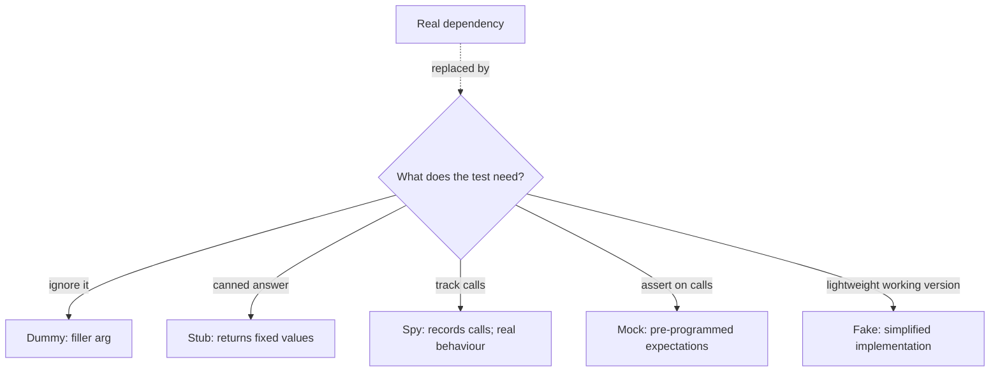
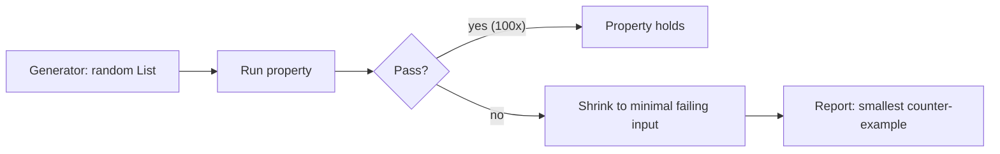

# Test doubles, property-based testing, mutation testing

When you replace a real dependency with a test substitute, that substitute is called a **test double**. Most engineers say "mock" for everything; that imprecision causes tests to drift. The five-name taxonomy from Gerard Meszaros (xUnit Test Patterns) is worth knowing — both because it sharpens reasoning and because senior interviews ask about it.

## The five doubles



| Double | Behaviour                                  | When to use                                     |
| ------ | ------------------------------------------ | ----------------------------------------------- |
| Dummy  | Passed but never used                      | Filler argument; the test does not exercise it  |
| Stub   | Returns canned values                      | You need a known answer for inputs              |
| Spy    | Records calls; behaves like real           | You want to assert on side effects of real code |
| Mock   | Pre-programmed expectations + verification | You want to assert on **interactions**          |
| Fake   | Working implementation, simplified         | In-memory repository, fake clock                |

```java
// Stub — Mockito's when().thenReturn() creates a stub
when(repository.findById(1L)).thenReturn(Optional.of(user));

// Mock — verify interactions afterwards
verify(emailClient).send(eq(user.email()), anyString());
verify(emailClient, never()).send(eq("admin@example.com"), anyString());

// Fake — a real but simplified implementation
class InMemoryUserRepo implements UserRepo {
    private final Map<Long, User> store = new HashMap<>();
    public Optional<User> findById(Long id) { return Optional.ofNullable(store.get(id)); }
    public void save(User u) { store.put(u.id(), u); }
}
```

**Senior insight**: prefer fakes over mocks when the interface is small. Mocks couple tests to specific call sequences; refactoring breaks them even when behaviour is unchanged. Fakes test against actual semantics.

## When mocks become a problem

```java
// This test asserts the implementation, not the behaviour
@Test
void processesOrder() {
    service.process(order);
    InOrder inOrder = inOrder(validator, payment, shipment, notifier);
    inOrder.verify(validator).validate(order);
    inOrder.verify(payment).charge(order);
    inOrder.verify(shipment).schedule(order);
    inOrder.verify(notifier).notify(order);
}
```

Refactor: notify before shipment? Combine validator and payment? Test breaks. The test is asserting **how** the service works, not **what** it does. Symptoms of over-mocking:

- Test setup is longer than the production code.
- Refactors break tests with no behaviour change.
- Tests verify call order without good reason.
- Mocks return mocks — the dependency graph is faked all the way down.

The fix: replace some mocks with fakes; assert on observable outcomes (state, returned values) instead of interactions.

## Property-based testing

Traditional tests check specific examples. Property-based tests check **invariants** that should hold for all inputs. The framework generates random inputs (often hundreds), runs the property, and **shrinks** any failing input to its minimal counter-example.

```java
// jqwik — JUnit 5 compatible
@Property
void reverseTwiceIsIdentity(@ForAll List<Integer> xs) {
    assertThat(reverse(reverse(xs))).isEqualTo(xs);
}

@Property
void sortIsIdempotent(@ForAll List<Integer> xs) {
    List<Integer> sorted = sort(xs);
    assertThat(sort(sorted)).isEqualTo(sorted);
}

@Property
void encodeDecodeRoundtrip(@ForAll @StringLength(min = 0, max = 100) String s) {
    assertThat(decode(encode(s))).isEqualTo(s);
}
```

**Properties to look for**:

- **Roundtrip**: `decode(encode(x)) == x`.
- **Idempotency**: `f(f(x)) == f(x)` (sort, dedupe, normalise).
- **Inverse**: `unzip(zip(a, b)) == (a, b)`.
- **Invariants**: `length(sort(xs)) == length(xs)`, `sum(xs) == sum(reverse(xs))`.
- **Oracle**: compare a fast implementation to a slow obviously-correct one.

When a property fails, the framework shrinks the failing input. Random `[8, 0, -147, 22]` shrinks to `[0, -1]` — the minimal failing case.



## Mutation testing — testing your tests

Mutation testing changes your production code in small ways (`>` becomes `>=`, `+` becomes `-`, a line is removed) and runs your test suite against each mutation. If a mutated version still passes, the mutation **survived** — meaning your tests do not actually verify that behaviour.

PIT (Java), Stryker (JS/TS), Mutmut (Python) are the standard tools.

```
=== PIT mutation report ===
Killed:    127 mutations (88%)
Survived:   17 mutations (12%)

Survived mutations:
  OrderService.java:42 — boundary check `if (count > 0)` mutated to `if (count >= 0)` — survived
  PriceCalc.java:18  — multiplication mutated to division — survived
```

The 12% surviving mutations point at code paths your tests do not actually exercise. **Coverage > 90%** with **mutation kill rate < 60%** means most of your tests are running code without asserting anything meaningful.

| Coverage | Mutation kill rate | Health                                                        |
| -------- | ------------------ | ------------------------------------------------------------- |
| Low      | Low                | Few tests, weak                                               |
| High     | Low                | Tests run code but don't assert (false confidence)            |
| High     | High               | Strong tests                                                  |
| Low      | High               | Rare; often a tightly-tested core surrounded by untested glue |

Mutation testing is slow (run the whole suite per mutation). Run it on critical packages, not the whole codebase, and as a nightly job.

## Test doubles for time, randomness, IDs

Production code that uses `Instant.now()`, `Random`, or `UUID.randomUUID()` is hard to test. **Inject a clock and an ID generator**:

```java
class OrderService {
    private final Clock clock;
    private final Supplier<UUID> ids;

    OrderService(Clock clock, Supplier<UUID> ids) {
        this.clock = clock;
        this.ids = ids;
    }

    Order place() {
        return new Order(ids.get(), Instant.now(clock));
    }
}

// In test
Clock fixed = Clock.fixed(Instant.parse("2024-01-01T00:00:00Z"), ZoneOffset.UTC);
Supplier<UUID> deterministic = () -> UUID.fromString("11111111-1111-1111-1111-111111111111");

OrderService service = new OrderService(fixed, deterministic);
```

Now tests are deterministic. The clock can also be a **`MutableClock`** that advances on demand, allowing time-based behaviour tests.

## Common pitfalls

- **Treating all doubles as mocks**. Linguistic precision changes how you reason about tests.
- **Mocks returning mocks ad infinitum**. Fix the design — the dependency graph is too deep, or the test is at the wrong level.
- **Property tests that shrink to the same trivial case**. The generator is too narrow; broaden the input space.
- **Mutation testing on UI code**. Most UI mutations are uninteresting. Run mutation testing on pure logic and core algorithms.
- **Ignoring `@MockBean` performance cost in Spring**. Each new `@MockBean` invalidates the Spring context cache, restarting the context. Group tests by mock configuration.

## Interview answers

_Q: When would you choose a fake over a mock?_
A: When the interface is small, well-defined, and the implementation is easy to reproduce in memory. A `Map`-backed `UserRepository` survives refactors that swap mocks for new ones. Fakes test the **contract**; mocks test **specific calls**.

_Q: What kind of bugs does property-based testing find that example-based does not?_
A: Edge cases you did not think to write. Off-by-one at boundaries, integer overflow, empty collections, very long strings, Unicode surprises. The shrinking step turns a 200-element failing case into a 2-element minimal one — much easier to debug than a random fuzz failure.

_Q: When does mutation testing run too slow to use?_
A: Each mutation runs the whole suite. For a 5-minute suite with 1000 mutations, that is ~83 hours. Mitigations: parallelise, run only on changed code, run nightly, scope to critical packages, use incremental analysis (PIT can do this).

_Q: How would you test code that depends on the current time?_
A: Inject a `Clock` (Java) or equivalent abstraction. In production, pass `Clock.systemUTC()`. In tests, pass `Clock.fixed(...)` or a mutable test clock. Avoid hidden static calls to `Instant.now()` or `LocalDate.now()`.

_Q: What's the difference between a stub and a mock?_
A: A stub returns canned values; the test asserts on the **outcome** (return value, state). A mock pre-programs expectations about how it will be called and verifies them as the test runs. Stubs help; mocks judge. Mocks are stricter, more brittle, and less refactor-friendly.

_Q: When is high coverage misleading?_
A: When tests execute code without asserting on its behaviour. A 90% coverage suite that asserts only that "no exception is thrown" passes if you delete most of the production logic. Mutation testing is the cure — it measures whether your assertions actually depend on the code's behaviour.
