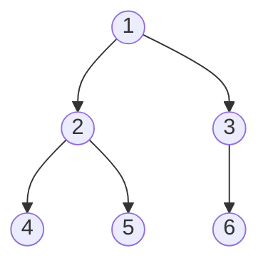
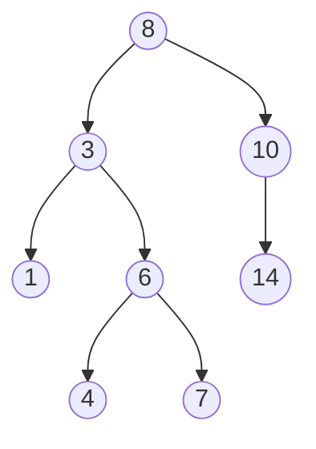
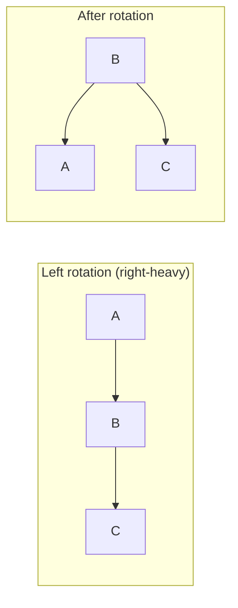
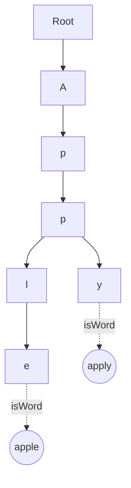

# Trees: BFS/DFS, LCA, diameter, BST validation, AVL rotations, Trie

A tree is a connected graph with no cycles. Pick any node as the **root** and the rest hang below it. Every node except the root has exactly one parent. Trees model hierarchy: file systems, DOM, organisation charts, expression trees, decision paths.

The two non-negotiable skills for tree problems: pick the right **traversal order**, and keep just enough **state** to avoid repeating work.



```java
class TreeNode {
    int val;
    TreeNode left, right;
    TreeNode(int val) { this.val = val; }
}
```

## Traversals

| Order             | Visit pattern     | Useful for                                |
| ----------------- | ----------------- | ----------------------------------------- |
| Preorder          | node, left, right | Serialization, copying                    |
| Inorder           | left, node, right | BST sorted output                         |
| Postorder         | left, right, node | Height, diameter, deletion, bottom-up DP  |
| Level-order (BFS) | layer by layer    | Shortest unweighted distance, layer count |

```java
// Recursive — natural and short
void inorder(TreeNode node, List<Integer> out) {
    if (node == null) return;
    inorder(node.left, out);
    out.add(node.val);
    inorder(node.right, out);
}

// Iterative — manual stack, avoids recursion depth limits
void inorderIter(TreeNode root, List<Integer> out) {
    Deque<TreeNode> stack = new ArrayDeque<>();
    TreeNode curr = root;
    while (curr != null || !stack.isEmpty()) {
        while (curr != null) {
            stack.push(curr);
            curr = curr.left;
        }
        curr = stack.pop();
        out.add(curr.val);
        curr = curr.right;
    }
}

// Level-order BFS
List<List<Integer>> levelOrder(TreeNode root) {
    List<List<Integer>> result = new ArrayList<>();
    if (root == null) return result;
    Deque<TreeNode> queue = new ArrayDeque<>();
    queue.offer(root);
    while (!queue.isEmpty()) {
        int size = queue.size();
        List<Integer> level = new ArrayList<>();
        for (int i = 0; i < size; i++) {
            TreeNode node = queue.poll();
            level.add(node.val);
            if (node.left != null) queue.offer(node.left);
            if (node.right != null) queue.offer(node.right);
        }
        result.add(level);
    }
    return result;
}
```

The **`size = queue.size()` snapshot** is the trick that lets you process one layer at a time.

## Lowest Common Ancestor (LCA)

The LCA of two nodes is the deepest node that has both as descendants. The recursive solution is elegant:

```java
TreeNode lca(TreeNode root, TreeNode p, TreeNode q) {
    if (root == null || root == p || root == q) return root;
    TreeNode left = lca(root.left, p, q);
    TreeNode right = lca(root.right, p, q);
    if (left != null && right != null) return root;  // p and q on different sides
    return left != null ? left : right;              // both on one side
}
```

The intuition: every recursive call asks "did you find p or q below here?" If both subtrees say yes, this node is the meeting point. If only one does, bubble its answer upward.

## Tree diameter

The diameter is the longest path between any two nodes (counted in edges).

The trick: at every node, compute its left and right subtree heights. The longest path **through** that node is `leftHeight + rightHeight`. Track the global maximum while returning height upward.

```java
private int diameter = 0;

int diameterOfBinaryTree(TreeNode root) {
    height(root);
    return diameter;
}

private int height(TreeNode node) {
    if (node == null) return 0;
    int left = height(node.left);
    int right = height(node.right);
    diameter = Math.max(diameter, left + right);
    return 1 + Math.max(left, right);
}
```

This pattern — return one thing, update a global on the side — generalises to "longest path with property X", "max sum path", "univalue subtree count", and many others.

## Binary Search Tree (BST)

A BST is a tree where every node's value is greater than all values in its left subtree and less than all values in its right subtree. **Inorder traversal of a BST returns sorted values.**



**Validation** — common bug is to compare each node only with its parent. That misses cases like `7` being a right descendant of `3` but accidentally sitting in `8`'s left subtree. Fix: pass `(min, max)` bounds inherited from ancestors.

```java
boolean isValidBST(TreeNode node, Long min, Long max) {
    if (node == null) return true;
    if ((min != null && node.val <= min) || (max != null && node.val >= max)) return false;
    return isValidBST(node.left, min, (long) node.val)
        && isValidBST(node.right, (long) node.val, max);
}
```

**Search and insert** are `O(log n)` on a balanced tree, `O(n)` on a worst-case skewed one.

## AVL trees — self-balancing BST

A plain BST can degenerate into a linked list if you insert sorted data: `1, 2, 3, 4, 5` builds a right-only chain. AVL trees fix this by tracking each node's **balance factor** (`leftHeight - rightHeight`). If it ever exceeds `±1`, the tree rotates locally to restore balance.

The four rotation cases:



You almost never code AVL rotations live in interviews. Know that:

- Insert and delete are `O(log n)` because height stays in `O(log n)`.
- Rotations preserve **inorder order** while changing structure.
- Real-world equivalents: red-black trees (Java's `TreeMap`, C++'s `std::map`, Linux's CFS scheduler), B-trees in databases, splay trees.

## Trie — prefix tree

A trie stores strings by their characters. Each node has children indexed by character and a flag `isWord`. Insert and lookup are `O(L)` where `L` is the string length, independent of the dictionary size.

```java
class Trie {
    static class Node { Map<Character, Node> kids = new HashMap<>(); boolean isWord; }
    private final Node root = new Node();

    public void insert(String word) {
        Node curr = root;
        for (char c : word.toCharArray()) {
            curr = curr.kids.computeIfAbsent(c, k -> new Node());
        }
        curr.isWord = true;
    }

    public boolean search(String word) {
        Node curr = find(word);
        return curr != null && curr.isWord;
    }

    public boolean startsWith(String prefix) {
        return find(prefix) != null;
    }

    private Node find(String s) {
        Node curr = root;
        for (char c : s.toCharArray()) {
            curr = curr.kids.get(c);
            if (curr == null) return null;
        }
        return curr;
    }
}
```



Tries power autocomplete, prefix search, IP routing tables (compressed tries called Patricia tries), and dictionary problems like "word break" or "longest common prefix."

## Common mistakes

- **Using `node.val` comparisons in BST validation instead of bounds**. Misses descendants that violate the BST property indirectly.
- **Recursive DFS on deep trees**. Java's default stack overflows around 10 K frames. For balanced trees this is fine; for linked-list-shaped inputs use iterative traversal.
- **Diameter counted as nodes vs edges**. Most problems define it as edges. Read the problem.
- **BFS without `size` snapshot**. If you need per-level work, capture `queue.size()` once at the start of each iteration.

## Interview answers

_Q: When does a BST inorder traversal not give sorted output?_
A: When the tree is not actually a valid BST — that is the whole point of validation. A buggy insert routine, a tree built from arbitrary data, or duplicate-handling that diverges from the BST contract can break inorder order.

_Q: How does Lowest Common Ancestor work in a BST?_
A: Walk down from the root. If both `p` and `q` are smaller, go left. If both are larger, go right. The first node where they split (or where one equals the current node) is the LCA. `O(h)` time, no recursion needed.

_Q: Why are red-black trees preferred over AVL trees in standard libraries?_
A: AVL is more strictly balanced (heights within `±1`), so lookups are slightly faster. Red-black tolerates slightly more imbalance (up to 2x), which means fewer rotations on insert and delete. For workloads with many writes — like `TreeMap` — red-black wins on average.

_Q: When would you use a trie over a hash set?_
A: When you need prefix queries: "all words starting with 'pre'", autocomplete, or longest-prefix-match (used in IP routing). A hash set gives `O(1)` exact lookup but no prefix support. Tries also share structure between similar strings, saving memory on large dictionaries.

_Q: How do you serialize and deserialize a binary tree?_
A: Preorder traversal with explicit nulls. Output `"1,2,#,#,3,#,#"`. To deserialize, read tokens one at a time and recursively rebuild — `#` becomes a null leaf, anything else becomes a node whose children are the next two recursive calls. Inorder alone does not work because two different trees can have the same inorder.
