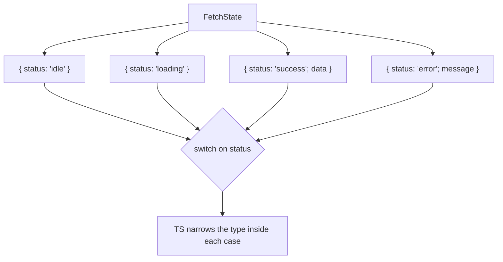

# TypeScript: types vs interfaces, unions, generics, utility types

TypeScript adds a static type system on top of JavaScript. Types are erased at compile time — at runtime, your code is plain JS. The value is **catching bugs before they ship**: misspelled fields, wrong argument types, forgotten cases in a switch, broken refactors.

Senior interviews probe whether you can use the type system to **encode invariants** and produce better APIs, not just "annotate everything as `any`."

## Types vs interfaces

Both can describe object shapes. Differences are mostly stylistic, with a few corner cases.

```ts
// Type alias
type User = {
  id: string
  name: string
  age: number
}

// Interface
interface User {
  id: string
  name: string
  age: number
}
```

| Feature                   | Type alias | Interface            |
| ------------------------- | ---------- | -------------------- |
| Object shapes             | ✓          | ✓                    |
| Unions and intersections  | ✓          | ✗ (only via extends) |
| Primitives, tuples        | ✓          | ✗                    |
| Declaration merging       | ✗          | ✓                    |
| Computed and mapped types | ✓          | ✗                    |
| Recursive types           | ✓          | ✓                    |

**Practical rule**: use whichever your codebase standardises. `type` is more flexible and works for everything. `interface` is preferred by some teams for declaration merging (extending library types) and slightly better error messages on object shapes.

## Unions — model alternatives

A union type means "any of these." Discriminated unions are TypeScript's superpower for modeling state machines.

```ts
type FetchState =
  | { status: 'idle' }
  | { status: 'loading' }
  | { status: 'success'; data: User[] }
  | { status: 'error'; message: string }

function render(state: FetchState) {
  switch (state.status) {
    case 'idle':    return <Idle />
    case 'loading': return <Spinner />
    case 'success': return <List items={state.data} />     // data narrowed correctly
    case 'error':   return <Error msg={state.message} />
  }
}
```

The compiler **narrows** based on the discriminant (`status`). Inside the `'success'` case, `state.data` is typed as `User[]` — even though it does not exist on the other variants. Add a fifth variant later, and every switch missing a case fails to compile.



## Generics — keep types flowing through

Generics let functions and components preserve types from caller to callee.

```ts
function first<T>(arr: T[]): T | undefined {
  return arr[0]
}

const n = first([1, 2, 3]) // n: number | undefined
const s = first(['a', 'b']) // s: string | undefined
```

Without the generic, you would lose the type — `function first(arr: any[]): any`.

Generic constraints (`extends`) restrict what the caller can pass:

```ts
function getProperty<T, K extends keyof T>(obj: T, key: K): T[K] {
  return obj[key]
}

const user = { id: '1', name: 'Alice', age: 30 }
const name = getProperty(user, 'name') // name: string
const age = getProperty(user, 'age') // age: number
const bad = getProperty(user, 'email') // ✗ compile error: 'email' does not exist on user
```

Generic components in React:

```tsx
type SelectProps<T> = {
  options: T[]
  getLabel: (option: T) => string
  onSelect: (option: T) => void
}

function Select<T>({ options, getLabel, onSelect }: SelectProps<T>) {
  return (
    <ul>
      {options.map((opt, i) => (
        <li key={i} onClick={() => onSelect(opt)}>
          {getLabel(opt)}
        </li>
      ))}
    </ul>
  )
}

;<Select
  options={users} // T inferred as User
  getLabel={(u) => u.name} // u: User
  onSelect={(u) => console.log(u)} // u: User
/>
```

## Utility types — built-in transformations

| Utility         | What it does                        | Example                            |
| --------------- | ----------------------------------- | ---------------------------------- |
| `Partial<T>`    | Make all properties optional        | `Partial<User>` for PATCH requests |
| `Required<T>`   | Make all properties required        | Reverse of Partial                 |
| `Pick<T, K>`    | Pick a subset of properties         | `Pick<User, 'id' \| 'name'>`       |
| `Omit<T, K>`    | All properties except K             | `Omit<User, 'password'>`           |
| `Readonly<T>`   | All properties readonly             | Immutable input                    |
| `Record<K, V>`  | Map of K to V                       | `Record<string, number>`           |
| `Awaited<T>`    | Unwrap a Promise                    | `Awaited<Promise<User>>` → `User`  |
| `ReturnType<F>` | Return type of a function           | `ReturnType<typeof fetchUser>`     |
| `Parameters<F>` | Parameters of a function as a tuple | `Parameters<typeof greet>`         |

```ts
type User = { id: string; name: string; password: string }
type PublicUser = Omit<User, 'password'> // { id, name }
type UpdateUser = Partial<User> // all optional
type UserMap = Record<string, User> // map of id → user
```

## Type narrowing — let the compiler help

```ts
function format(value: string | number | Date): string {
  if (typeof value === 'string') return value.toUpperCase()
  if (typeof value === 'number') return value.toFixed(2)
  return value.toISOString() // narrowed to Date
}

// In operator
function area(shape: Circle | Rectangle): number {
  if ('radius' in shape) return Math.PI * shape.radius ** 2
  return shape.width * shape.height
}

// User-defined type guard
function isUser(value: unknown): value is User {
  return typeof value === 'object' && value !== null && 'id' in value
}
```

Type guards (`is` predicates) are how you teach the compiler about runtime checks it cannot infer.

## Branded types — distinguish look-alike primitives

```ts
type UserId = string & { readonly __brand: 'UserId' }
type OrderId = string & { readonly __brand: 'OrderId' }

function loadUser(id: UserId) { ... }

const userId = 'abc' as UserId
const orderId = 'xyz' as OrderId

loadUser(userId)    // ✓
loadUser(orderId)   // ✗ compile error — different brand
```

Brilliant for type-level safety on values that are runtime-identical strings or numbers.

## Strict mode — turn it on

```jsonc
// tsconfig.json
{
  "compilerOptions": {
    "strict": true, // enables all strict checks
    "noUncheckedIndexedAccess": true, // arr[0] is T | undefined
    "exactOptionalPropertyTypes": true,
    "noImplicitOverride": true,
    "noFallthroughCasesInSwitch": true,
  },
}
```

`strict: true` catches whole bug categories (null checks, implicit any, function parameter variance). Turn it on. Without strict mode, TypeScript is half a type system.

## Common mistakes

- **Using `any`**. Disables checking. Prefer `unknown` and narrow with type guards.
- **Type assertions (`as`) instead of guards**. Lies to the compiler. Bug magnet at runtime.
- **Disabling rules globally to silence one error**. Fix the type, do not silence the rule.
- **Over-typing**. Annotating every local variable and function return when inference is fine. Trust inference for locals; annotate at API boundaries.
- **Reaching for utility types when domain types would be clearer**. `Omit<Pick<Partial<User>, 'name'>, 'password'>` is unreadable. Define the type plainly.
- **Mixing `interface` and `type` randomly**. Pick a convention.
- **Treating `enum` as the only "set of constants"**. Discriminated unions and `as const` literals are usually better — no runtime overhead, narrowable.

## Interview answers

_Q: When would you choose `interface` over `type`?_
A: When you need declaration merging (extending types from third-party libraries) or your team's convention says so. For most cases, `type` is more flexible and the compiler gives slightly better error messages either way. Pick one and stay consistent.

_Q: How do discriminated unions help with state?_
A: They model "exactly one of these shapes" and let TypeScript narrow the type based on a discriminant field. The compiler ensures every case is handled and that you can only access fields valid in the current variant. They are a much better fit for state machines than overloading optional fields.

_Q: What's the difference between `unknown` and `any`?_
A: `any` opts out of type checking — you can do anything to it. `unknown` is the safe top type — you cannot use it until you narrow it via a type guard or assertion. Always prefer `unknown` for inputs from untrusted sources (API responses, user input).

_Q: When are generics overkill?_
A: When the function only ever uses one type. `function add(a: number, b: number)` does not need a generic. Add generics only when the caller should decide the type and you want to preserve it through the function.

_Q: How would you type a function that returns a different shape depending on an argument?_
A: Function overloads. Define multiple signatures, then a single implementation:

```ts
function get(key: 'count'): number
function get(key: 'name'): string
function get(key: string): unknown {
  return data[key]
}
```

_Q: What's `as const` for?_
A: It tells TypeScript to infer the **most specific** type — exact literals, readonly arrays, readonly tuples. `const obj = { type: 'user' } as const` gives `{ readonly type: 'user' }` instead of `{ type: string }`. Useful for action types, configuration constants, and discriminated union literals.

_Q: How do you type a React event handler precisely?_
A: Use the event type from React: `(e: React.ChangeEvent<HTMLInputElement>) => void`. For generic handlers, `(e: React.SyntheticEvent) => void`. The element type narrows what's available on `e.target` (e.g. `e.target.value` for inputs).
