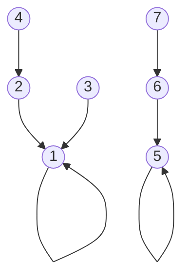
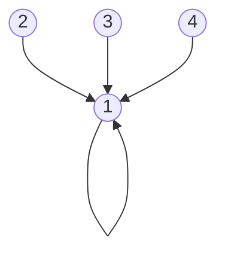

# Union-Find / DSU: path compression, union by rank, Kruskal, connectivity

Union-Find (also called Disjoint Set Union, DSU) is a tiny data structure that answers two questions in near-constant time:

1. **Are these two elements in the same group?** (`find`)
2. **Merge their groups.** (`union`)

It does not let you list a group's members or remove an element. That is the trade-off for the speed.

DSU powers Kruskal's MST, dynamic connectivity, "accounts merge" problems, image segmentation, percolation, and offline graph queries. At senior level, it is the difference between an elegant `O(α(n))` solution and a clumsy BFS-based one.

## How it works

Each element points to a parent. The root of a tree represents the group. Two elements are in the same group if they share a root.



Two groups: `{1, 2, 3, 4}` (root 1) and `{5, 6, 7}` (root 5). To check if `4` and `7` are connected: `find(4)` walks 4 → 2 → 1, returns 1; `find(7)` walks 7 → 6 → 5, returns 5. Different roots → different groups.

## Implementation with both optimisations

```java
class DSU {
    int[] parent, rank;
    int components;     // running count of groups

    DSU(int n) {
        parent = new int[n];
        rank = new int[n];
        components = n;
        for (int i = 0; i < n; i++) parent[i] = i;     // each element is its own root
    }

    int find(int x) {
        // Path compression — flatten the tree on the way back up
        if (parent[x] != x) parent[x] = find(parent[x]);
        return parent[x];
    }

    boolean union(int x, int y) {
        int rx = find(x), ry = find(y);
        if (rx == ry) return false;                     // already connected
        // Union by rank — attach the shorter tree under the taller
        if (rank[rx] < rank[ry]) parent[rx] = ry;
        else if (rank[rx] > rank[ry]) parent[ry] = rx;
        else { parent[ry] = rx; rank[rx]++; }
        components--;
        return true;
    }

    boolean connected(int x, int y) { return find(x) == find(y); }
}
```

## The two optimisations matter

| Variant                    | `find` per call       |
| -------------------------- | --------------------- |
| Naive                      | `O(n)` worst case     |
| Path compression only      | `O(log n)` amortised  |
| Union by rank/size only    | `O(log n)` worst case |
| Both — the modern standard | `O(α(n))` ≈ `O(1)`    |

`α(n)` is the inverse Ackermann function. It grows so slowly that for any practical `n` (up to `2^65536`), `α(n) ≤ 4`. For algorithm analysis purposes, treat union-find operations as constant-time.

## Path compression in action

After `find(4)` on the tree above with path compression:



Element 4 now points directly to root 1. Future `find(4)` calls are `O(1)`. Repeated finds amortise to constant time.

## Use case 1 — Kruskal's MST

Sort edges by weight, take each if it does not form a cycle (cycle ↔ both endpoints already in the same group).

```java
int kruskal(int n, int[][] edges) {       // edges = [u, v, weight]
    Arrays.sort(edges, (a, b) -> a[2] - b[2]);
    DSU dsu = new DSU(n);
    int total = 0, taken = 0;
    for (int[] e : edges) {
        if (dsu.union(e[0], e[1])) {
            total += e[2];
            if (++taken == n - 1) break;
        }
    }
    return taken == n - 1 ? total : -1;   // -1 if graph is disconnected
}
```

## Use case 2 — counting connected components in a streaming graph

```java
int countComponents(int n, int[][] edges) {
    DSU dsu = new DSU(n);
    for (int[] e : edges) dsu.union(e[0], e[1]);
    return dsu.components;
}
```

DSU shines here: edges arrive online, total cost is `O(E α(V))`. Rebuilding via BFS each query would be `O(V + E)` per query.

## Use case 3 — accounts merge

Each user has multiple email accounts. Merge accounts that share any email.

```java
List<List<String>> accountsMerge(List<List<String>> accounts) {
    int n = accounts.size();
    DSU dsu = new DSU(n);
    Map<String, Integer> emailToIndex = new HashMap<>();
    for (int i = 0; i < n; i++) {
        for (int j = 1; j < accounts.get(i).size(); j++) {
            String email = accounts.get(i).get(j);
            if (emailToIndex.containsKey(email)) {
                dsu.union(i, emailToIndex.get(email));
            } else {
                emailToIndex.put(email, i);
            }
        }
    }
    Map<Integer, TreeSet<String>> grouped = new HashMap<>();
    for (var entry : emailToIndex.entrySet()) {
        int root = dsu.find(entry.getValue());
        grouped.computeIfAbsent(root, k -> new TreeSet<>()).add(entry.getKey());
    }
    // ...build the result with names and sorted emails
    return new ArrayList<>();  // shape elided for brevity
}
```

The DSU lets the merging be **transitive across accounts** without explicitly traversing.

## Variants

- **Weighted union-find** — track a `weight[i]` representing offset from the root. Used in problems like "is `a` exactly `k` more than `b`?" (e.g. Leetcode 399 evaluate division).
- **Rollback union-find** — store every union in a stack. Useful for offline algorithms that need to undo. Cannot use path compression in this variant; it breaks rollback.
- **Persistent union-find** — keep snapshots so old states are queryable. Used in offline range queries.

## Common mistakes

- **Forgetting path compression**. Tree degenerates into a linked list under adversarial unions; `find` becomes `O(n)`.
- **Forgetting union by rank**. Without it, naive union always attaches one tree to the other and re-creates the linked-list problem.
- **Decrementing component count on already-connected pairs**. Only decrement when the union actually merged two distinct groups (return value of `union`).
- **Modifying the parent during `find` while iterating elsewhere**. Path compression mutates state on read. If you depend on parent layout for ordering or display, take a snapshot first.

## Interview answers

_Q: When would you reach for DSU instead of BFS or DFS?_
A: When the question is "are these connected?" answered repeatedly online, or when edges arrive over time, or when you build MST. BFS each time costs `O(V + E)` per query; DSU costs `O(α(n))` per query after `O(E α(V))` setup.

_Q: Why is the inverse Ackermann complexity essentially constant?_
A: For any input size that fits in the universe (up to `2^65536` and beyond), `α(n) ≤ 4`. The function grows so slowly that no practical workload distinguishes it from a constant. This is why textbooks treat DSU as `O(1)` amortised.

_Q: Walk me through "redundant connection."_
A: Iterate edges of an undirected graph. For each `(u, v)`, if they are already connected, this edge is the redundant one — return it. Otherwise, union them. The first edge that fails to union is your answer.

_Q: How do you make union-find handle weighted edges with offsets?_
A: Augment with a `weight[]` array. During `find`, accumulate the offset along the path. During `union`, use the existing offsets of both roots to compute the parent's new weight that satisfies the constraint. The math takes care; the structure is a 2-line addition to the standard DSU.

_Q: Can DSU support delete or split?_
A: No, not efficiently. The data structure is one-way: merge only. For workloads that need split, use link-cut trees or segment trees with offline processing. In practice this almost never matters — most problems are merge-only.
