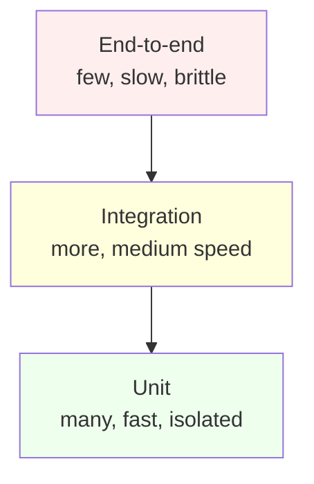
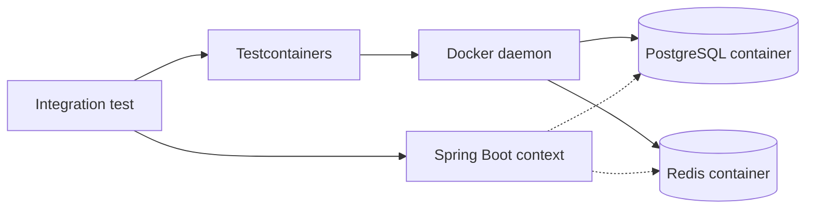
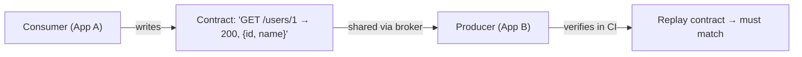

# Unit, integration, and contract testing: scope, isolation, fakes vs mocks

Tests exist to give you confidence that you can change code without breaking things. Senior engineers know **what kind of bugs each test type catches**, what they miss, and when adding a test is wasted effort. "100% coverage" is not a goal; "I can ship Friday afternoon" is.

## Test pyramid



The traditional advice: many fast unit tests, fewer integration tests, very few end-to-end tests. Modern services often invert toward integration tests because mocks lie at scale — but the principle holds: cheap fast tests at the bottom, expensive slow ones at the top.

## What each test type catches

| Type        | Scope                                | Speed        | Catches                                       | Misses                    |
| ----------- | ------------------------------------ | ------------ | --------------------------------------------- | ------------------------- |
| Unit        | One class, dependencies stubbed      | < 50 ms      | Logic errors, branches, edge cases            | Wiring, integration drift |
| Integration | Multiple components or a real DB     | 100 ms – 5 s | Wiring, ORM behaviour, schema mismatches      | Cross-service contracts   |
| Contract    | Producer ↔ consumer schema agreement | < 1 s        | API drift between services                    | Internal logic            |
| End-to-end  | Full stack, real browser / device    | 2 s – 60 s   | User-visible regressions, deployment glitches | Specific edge data        |

## Unit tests with JUnit 5 + Mockito

```java
@ExtendWith(MockitoExtension.class)
class OrderServiceTest {

    @Mock OrderRepository repo;
    @Mock PaymentClient payments;
    @InjectMocks OrderService service;

    @Test
    void placesOrderWhenStockAvailable() {
        when(repo.reserve("sku-42", 1)).thenReturn(true);
        when(payments.charge(any(), eq(BigDecimal.valueOf(99))))
            .thenReturn(PaymentResult.ok("tx-1"));

        Order order = service.place(new PlaceOrder("u-1", "sku-42", 1, BigDecimal.valueOf(99)));

        assertThat(order.status()).isEqualTo(OrderStatus.CONFIRMED);
        verify(repo).save(any());
    }

    @Test
    void rejectsOrderWhenStockMissing() {
        when(repo.reserve("sku-42", 1)).thenReturn(false);

        assertThatThrownBy(() ->
            service.place(new PlaceOrder("u-1", "sku-42", 1, BigDecimal.valueOf(99))))
            .isInstanceOf(OutOfStockException.class);

        verifyNoInteractions(payments);
    }
}
```

Notice:

- Test names describe behaviour, not implementation.
- Each test exercises one branch.
- `verifyNoInteractions(payments)` proves the rejection path does not charge — a behavioural assertion as important as the thrown exception.

### What to assert in unit tests

| Assert                      | When                                   |
| --------------------------- | -------------------------------------- |
| Return value                | Pure function or computation           |
| State change                | Method modifies an injected dependency |
| Method called on dependency | Method delegates to a collaborator     |
| Exception thrown            | Error path                             |
| Method NOT called           | Guard clause or conditional behaviour  |

### What NOT to test in unit tests

- Getters and setters (no logic).
- Framework code (Spring's DI, JPA's mapping — those have their own tests).
- Logging output (brittle and irrelevant).
- Implementation details (refactor-resistant tests must assert behaviour, not internals).

## Integration tests with Testcontainers

```java
@SpringBootTest
@Testcontainers
class OrderRepositoryIT {

    @Container
    static PostgreSQLContainer<?> postgres = new PostgreSQLContainer<>("postgres:16");

    @DynamicPropertySource
    static void props(DynamicPropertyRegistry registry) {
        registry.add("spring.datasource.url", postgres::getJdbcUrl);
        registry.add("spring.datasource.username", postgres::getUsername);
        registry.add("spring.datasource.password", postgres::getPassword);
    }

    @Autowired OrderRepository repo;

    @Test
    void persistsAndQueries() {
        repo.save(new Order("u-1", "sku-42", 1));
        assertThat(repo.findByUser("u-1")).hasSize(1);
    }
}
```

Use a **real database** for tests that depend on JPA, indexes, transactions, or vendor-specific SQL. **H2 in-memory hides too many bugs** — different SQL dialect, no real index behaviour, different transaction semantics. Testcontainers spin up Docker containers per test class and tear them down at the end.



## Spring slice tests

Bring up only the layer you need — faster than `@SpringBootTest`.

| Annotation        | Brings up                         | Use for                                        |
| ----------------- | --------------------------------- | ---------------------------------------------- |
| `@WebMvcTest`     | Controllers + Spring MVC infra    | Controller serialisation, validation, security |
| `@DataJpaTest`    | JPA + repositories + in-memory DB | Repository methods, JPQL queries               |
| `@JsonTest`       | Jackson + JSON serialisers        | DTO serialisation                              |
| `@RestClientTest` | RestTemplate / WebClient infra    | Outbound HTTP client behaviour                 |
| `@SpringBootTest` | Full context                      | True integration tests                         |

```java
@WebMvcTest(OrderController.class)
class OrderControllerTest {
    @Autowired MockMvc mvc;
    @MockBean OrderService service;

    @Test
    void returnsBadRequestOnInvalidPayload() throws Exception {
        mvc.perform(post("/orders").contentType(APPLICATION_JSON).content("{}"))
           .andExpect(status().isBadRequest());
    }
}
```

## Contract testing

The problem: service A consumes service B's API. B updates the schema. A's tests still pass against its mock of B. Production breaks.

**Consumer-driven contract** (Pact, Spring Cloud Contract): A writes a contract describing what it expects. The contract is shared with B. B's CI replays the contract against the actual API and fails the build if it has drifted.



Contract tests bridge the gap between unit tests (cheap mocks that lie) and end-to-end tests (slow, flaky). Every microservices system at scale ends up needing them.

## Test data strategies

| Strategy                  | Trade-off                                             |
| ------------------------- | ----------------------------------------------------- |
| In-memory builder         | Fast, type-safe, but easy to diverge from prod schema |
| Test fixtures (SQL files) | Realistic, but verbose and hard to maintain           |
| Object mother / factories | Reusable test object construction                     |
| Faker / random generators | Catches edge cases, but flaky if seed unpinned        |
| Property-based tests      | Forces invariants, finds tiny edge cases              |

## Common pitfalls

- **Mocking value objects**. `Mockito.mock(Order.class)` for a simple data record is silly. Construct it directly.
- **Over-mocking**. If your test stubs every method on every dependency, you are testing the mocks, not the code.
- **Asserting on log messages**. Brittle and irrelevant — refactor renames a class, the test breaks.
- **Tests that depend on each other**. Each test must run in isolation in any order. Shared state (static fields, system properties) leaks.
- **Integration tests against shared dev databases**. Flaky on CI when two PRs run at once.
- **Sleep-based timing**. `Thread.sleep(1000)` is the slowest reliable test in the suite. Use polling assertions (`Awaitility`) or deterministic clocks.
- **Big-bang `@SpringBootTest` for everything**. Slice tests are 10x faster. Only use full context when you actually need it.

## Interview answers

_Q: What is the difference between a mock and a stub?_
A: A **stub** returns canned values for inputs; the test does not care if it was called or with what arguments. A **mock** also verifies interactions — was it called, how often, with what arguments. Mockito blends both. Use stubs for "I need this method to return X"; use mocks only when "this method must be called exactly once with Y" is part of the behaviour you assert.

_Q: When would you write an integration test instead of a unit test?_
A: When the value of the test is in the wiring or the framework behaviour, not the algorithm. Repository methods, JPA queries, transaction propagation, request validation, security filters — all need real components to test meaningfully.

_Q: How do you test code that calls an external HTTP API?_
A: For unit tests, mock the client (`RestTemplate`/`WebClient`). For integration tests, use **WireMock** or **MockServer** to stand up a fake HTTP server returning recorded responses. For confidence at integration boundaries, **contract tests** with the real consumer's expectations.

_Q: What is property-based testing?_
A: Instead of writing test cases by hand, you specify a **property** (an invariant that should always hold) and let the framework generate hundreds of random inputs. If a property fails, the framework shrinks the input to the smallest failing case. JUnit-Quickcheck, jqwik, and Hypothesis are popular libraries.

_Q: How do you make integration tests fast?_
A: Reuse Spring contexts across tests with the same configuration (`@DirtiesContext` only when needed). Use Testcontainers' singleton container pattern so the DB starts once for the whole suite. Run tests in parallel with separate schemas per worker. Skip slice tests in fast development loops; run on CI.

_Q: When are mocks dangerous?_
A: When the contract between caller and dependency drifts and the mock keeps the old shape. Tests pass but production breaks. This is the canonical case for contract testing. Also dangerous: mocking your own internal collaborators when a real instance would do — the test starts asserting implementation, not behaviour.

_Q: What is a flaky test and how do you fix one?_
A: A flaky test passes sometimes and fails sometimes without code changes. Causes: timing assumptions, shared state, network calls, test order dependence, non-deterministic data. Fix: identify the source (often `Thread.sleep`, a real clock, or a shared resource), eliminate it. Quarantine flaky tests if the fix is delayed; do not retry-until-pass on CI as a culture.

_Q: What is mutation testing?_
A: A tool (PIT for Java) modifies your code in small ways (changes `>` to `>=`, removes a line, etc.) and runs your tests. If the tests still pass, the mutation "survived" — meaning your tests do not actually cover that behaviour. High-quality test suites kill > 80% of mutations. Reveals tests that pretend to cover but don't.
