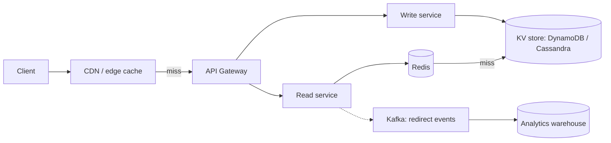
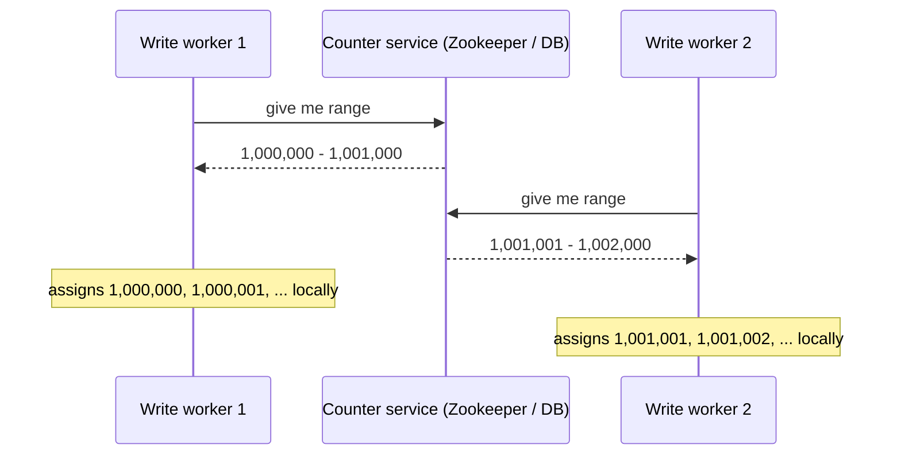
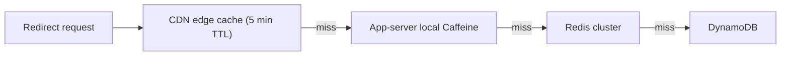
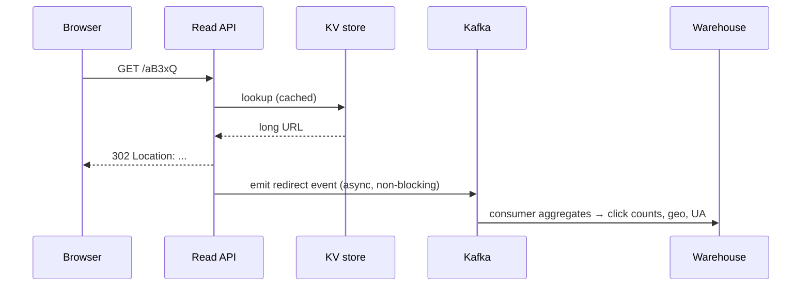

# Walkthrough: URL shortener (TinyURL)

The classic system design warmup. Shows you can decompose, estimate, pick components, and reason about hot paths. The complexity hides in the read path (cache, fast lookup) and the key generation (collisions, scalability).

## Step 1 — Clarify requirements

**Functional**:

- Shorten a long URL → return a short URL (e.g. `tiny.cc/aB3xQ`).
- Redirect short → long with HTTP 301/302.
- Optional custom alias (e.g. `tiny.cc/black-friday`).
- Optional expiry.
- Basic click analytics.

**Non-functional**:

- 100M new URLs per day.
- Redirect latency p95 < 100ms.
- Read:write ratio ~100:1.
- Links live forever by default.
- Highly available — redirects must keep working.

## Step 2 — Estimate

```
DAU         = ?  (irrelevant for shortener; URLs ≠ users)
Writes/day  = 100M
Reads/day   = 100M × 100 = 10B

Write QPS  = 100M / 86,400 ≈ 1,200      (peak × 3 ≈ 3,500)
Read QPS   = 10B / 86,400 ≈ 116,000     (peak × 3 ≈ 350,000)

Bytes per record = ~500 (short key, long URL, metadata)
Daily storage    = 100M × 500 = 50 GB/day
Yearly storage   = 18 TB/year
With 3x replication → 54 TB/year
5-year             → 270 TB
```

Read:write 100:1 + low data per record + hot keys = **caching is the most important decision**.

## Step 3 — Architecture



| Component        | Why it is here                                    |
| ---------------- | ------------------------------------------------- |
| CDN / edge cache | Sub-50ms global redirects for popular links       |
| API gateway      | TLS, rate limiting, auth (for write API)          |
| Read service     | Stateless, scales horizontally; no business logic |
| Write service    | Generates short key, persists                     |
| Redis cache      | Hot key cache, 100K+ ops/sec                      |
| KV store         | Single-key lookup, billions of rows, replication  |
| Kafka            | Async analytics fanout — does not block redirect  |
| Warehouse        | Aggregations, top-N, country breakdowns           |

## Step 4 — Key generation

The most interesting design decision.

| Approach                        | Pros                       | Cons                              |
| ------------------------------- | -------------------------- | --------------------------------- |
| Counter + base62 encode         | No collisions, predictable | Sequential keys leak total volume |
| Hash(URL) + truncate to 7 chars | Stateless                  | Collisions need retry             |
| Range allocation per worker     | Scalable, no collisions    | Operational complexity            |
| UUID + base62                   | Unique, no coordination    | Long (22 chars)                   |

### Counter + base62 (recommended for most cases)

Base62 = `[a-zA-Z0-9]`. 7 chars gives 62⁷ ≈ 3.5 trillion unique keys.

```
Counter:   1, 2, 3, 4, 5, ...
Base62:    'b', 'c', 'd', 'e', 'f', ...
Counter at 100M/day for 5 years = 1.8 × 10¹¹  → still 7 chars
```

**Where does the counter live?** A single Redis `INCR` is atomic and fast — but a single point of failure. Better: **range allocation**.



Each worker pre-allocates a range of 1000 IDs in a single DB call, then assigns them locally without coordination. Crash means lost IDs (gaps), which is fine.

### Hash + truncate

```python
short_key = base62(sha256(long_url))[:7]
```

Pros: stateless, deterministic (same URL → same key — useful or annoying depending on requirement).

Cons: collisions. With 100M URLs and 62⁷ keyspace, collision rate is ~1 in 35K. Must check on insert and retry with a longer key or a salt. Operational pain.

## Step 5 — Storage

The schema is small:

```sql
short_key  VARCHAR(8) PRIMARY KEY,
long_url   TEXT,
owner_id   VARCHAR(36),
created_at TIMESTAMP,
expires_at TIMESTAMP,
click_count BIGINT  -- maintained separately for low-frequency consistency
```

Pick a **key-value store**: DynamoDB, Cassandra, Bigtable. Single-key lookup is O(1). Replication and sharding handled by the DB.

For 5-year storage at 270 TB and 350K read QPS: DynamoDB can do this. Cost dominates — DynamoDB on-demand pricing for this workload is significant. Provisioned with autoscaling is cheaper.

## Step 6 — Caching



Multi-tier caching:

- **CDN at edge** for popular links — most aggressive cache, geographically distributed.
- **In-process cache** on each app server (Caffeine) — sub-µs, hottest 1% of keys.
- **Redis cluster** — 100K+ ops/sec, holds the warm 80%.
- **DB** — long tail.

Cache hit rate is huge because of Zipfian distribution: a small fraction of URLs get most of the traffic.

## Step 7 — Redirect handling

```http
GET /aB3xQ HTTP/1.1
Host: tiny.cc

→ HTTP/1.1 301 Moved Permanently
   Location: https://example.com/very-long-original-url
```

| Choice          | Effect                                           |
| --------------- | ------------------------------------------------ |
| 301 (permanent) | Browsers cache; analytics miss subsequent clicks |
| 302 (temporary) | Browsers may not cache; every click hits server  |

302 is the better choice if you care about click analytics. 301 is faster for users but invisibilises traffic.

## Step 8 — Analytics

Synchronous click counting on the redirect path is bad — every redirect would write to the DB. Fan out to Kafka:



Aggregation runs in batch (every 5 minutes or hourly) and updates a separate `click_stats` table.

## Step 9 — Failure cases to discuss

| Failure                                 | Mitigation                                                          |
| --------------------------------------- | ------------------------------------------------------------------- |
| Cache miss storm on a hot key after TTL | Single-flight (request coalescing); stale-while-revalidate          |
| Counter service down                    | Workers have pre-allocated ranges; degrade gracefully               |
| KV store failover                       | Multi-region replication; read from secondary if primary down       |
| Burst of writes from a campaign         | Per-tenant rate limiting at gateway                                 |
| Rogue custom alias collisions           | Unique constraint on short_key; reject duplicates                   |
| Malicious URLs (phishing, malware)      | Background scan against safe-browsing API; soft-delete on detection |
| Expired URLs                            | Background sweep; soft-delete + deny in read service                |

## Step 10 — Trade-offs the interviewer wants to hear

- **Counter + base62 vs hash**: counter is cleaner but leaks volume; hash is stateless but has collisions. Pick counter unless URL idempotency matters.
- **301 vs 302**: 301 is faster for users (browser cache); 302 preserves analytics. Default to 302.
- **Cache TTL**: longer TTL = better hit rate but stale data after edits. For URLs that rarely change, hours is fine. For owner-deleted URLs, propagation delay is acceptable.
- **Synchronous vs async analytics**: async every time. Redirect must not block.
- **Custom aliases**: separate keyspace from generated keys to avoid collision; reserve keywords (admin, login, etc.).
- **DynamoDB vs Cassandra**: DynamoDB is managed (less ops); Cassandra is open-source (more control). For 100M writes/day and 350K read QPS, both work.

## Common pitfalls

- **Hash + retry without bounding retries**. Adversary can engineer collisions; rate-limit + max-retry needed.
- **Storing click counts in the URL row**. 350K writes/sec to a single hot row destroys the DB. Aggregate offline.
- **CDN with too-long TTL**. Cache invalidation when URLs are edited or deleted is hard. Use short TTL or version the URL.
- **Sequential counter without sharding**. Becomes a bottleneck. Range allocation per worker fixes it.
- **Forgetting custom alias edge cases**. "/login", "/admin", reserved words, profanity. Maintain a denylist.

## Interview answers

_Q: How would you ensure the redirect is sub-100ms p95 globally?_
A: CDN at the edge with reasonable TTL caches popular URLs in the user's region. Sub-50ms anywhere. Cache miss falls back to a regional read service backed by a global KV store (Cassandra multi-region) and Redis. Cache hit rate dominates — make the cache as wide as possible, store only the redirect, not full metadata.

_Q: How do you generate unique short keys at scale?_
A: Range allocation. A central counter service hands out blocks of 1000 IDs to each worker. Workers assign locally with no further coordination. Encode the integer in base62 → 7 characters give 3.5 trillion keys, more than enough.

_Q: How do you handle a popular link suddenly getting traffic spike?_
A: Cache absorbs most of it. CDN at edge → in-process cache on each app server (Caffeine) → Redis cluster → DB. On cache miss, single-flight prevents stampede. If the spike is so big it overloads Redis, replicate the cache for the hot key across multiple Redis instances.

_Q: How do you delete a URL?_
A: Soft delete in the database. Read service returns 410 Gone for soft-deleted URLs. Cache TTL means propagation takes minutes — acceptable. Hard delete via background sweep after retention period.

_Q: How would you support analytics like top-N URLs by country?_
A: Redirect events flow to Kafka asynchronously. Consumers aggregate in batches (5-min windows) into a columnar store (BigQuery, ClickHouse, Redshift). Top-N queries run there. The redirect path itself is unaffected by analytics throughput.

_Q: When would custom aliases conflict with generated keys?_
A: When the alias's base62 representation collides with a future counter value. Solutions: prefix custom aliases with a special char (`*` or `_`) — but breaks URL readability. Or use separate prefix ranges (`a-z` for generated, `A-Z` for custom). Or check both spaces on every insert. Most production systems accept the small probability and simply reject collisions on insert.

_Q: How do you protect against URL spam and phishing?_
A: Async scan against Google Safe Browsing or similar API after creation. Mark suspicious URLs and either soft-delete or display a warning page before redirect. Rate-limit creation per IP and per account. Require authentication for high-volume creation. Reputation scoring on owner accounts.
